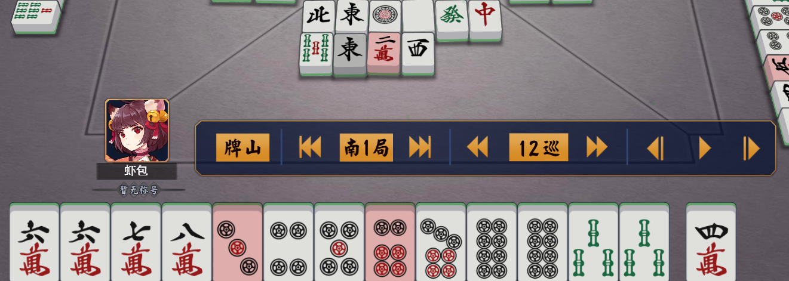
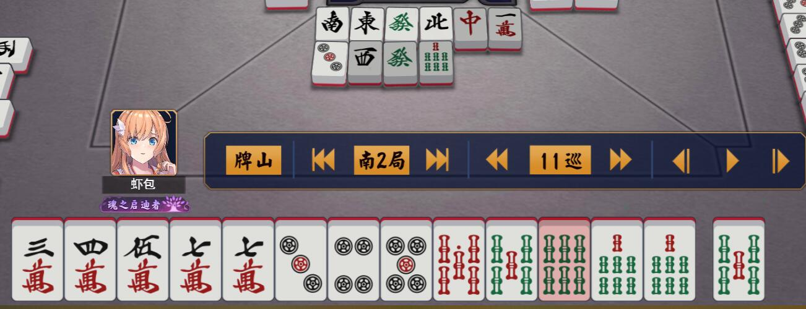

---

记录在意的牌谱

<!--more-->

## 0


问题：如上牌型，如果以成牌率优先，进了8索如何舍牌？

### 疑惑


以这个牌型候牌，如果进w3，5或p2，5，8都能直接听牌，但这时来了s8就很尴尬，这会是一个改良听型的机会吗，先说结论：是的。

### 分析

* 打s8的情况（也是获得改良前的情况）
    * 等来w3,5（8张）      ---> 听p3,6,9（11张）		
	* 等来p3,6,9 （11张）  ---> 听w3 或 听w5（4张）
	
    共等19张牌，其中8张是良型听牌。

* 打w2的情况
	* 等来w4,6（6张）      ---> 听p3,6,9（11张）
	* 等来w5（4张）        ---> 听p4,7 或 听p5,8（6张）
	* 等来p3,6,9（11张）   ---> 听w4 或 听w6（3张）
	* 等来p4,5,7,8（12张） ---> 听w5（4张）
	
    共等33张牌，其中10张是良型听牌。

待牌相差了14张，可见明显舍2w，对待牌进行改良来得划算，但有改良后会不会降低听牌的张数呢，若对听牌数以等待张数算加权平均数：

```none
舍s8听牌数 = (11*8+4*11)/(8+11) = 6.9
舍w2听牌数 = (11*6+6*4+3*11+4*12)/(6+4+11+12) = 5.8
```

结论是，会降低听牌张数，但这比起一向听时待牌差相差的14张，是可以忽略的。

### 瞎逼逼

* w2自己打过，应该考虑优先舍去
* 打错就打错了，不是良型，那么默听就好了


---

## 1

振听立直，不知道之前的择牌有没有问题。。




---

## 2


如果有立直的话是147m，这里1m没番+振听。
那一般就是打5m，听47m（7张）。
其实还有一个选项，打6m，听5m47p（6张）。    

---

## 3


---

## 4

这时候应该切8s场上已经没有8s了，切8s等7s


---

## 5

听四面


---

## 6

单吊改听三面，没看出来，这里做个记录：


摸上7s，没看出三面，觉得场上47s都没了(*如果这里立了，过几巡就自摸了)：


摸上5s，还是没看出三面，不然就是更好的58s,7w了：


最后立了个啥？？？


---

## 7


放的3p点了上家的庄，11600

---

## 8


何切？
