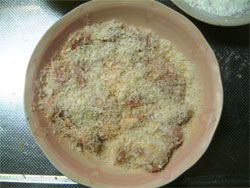

---

> via: <http://www.cafenavijp.com/tonkatu.htm>

## **おいしいトンカツの作り方/レシピ**

ハンバーグと並んで人気の高いトンカツ。おいしいトンカツを作るのは意外に簡単です。

材料　（３人前）

| 豚ロース     | ３６０～４５０ｇ |
| ------------ | ---------------- |
| 塩・コショウ | 適量             |
| 小麦粉       | 適量             |
| 卵           | １～２ヶ         |
| パン粉       | 適量             |

１．豚ロース（１人前１２０～１５０ｇ）についている余分な脂身を削ぎ落とします。

２．包丁の切先で豚ロース全体を突き刺します（両面）。

３．揚げたときに縮むのを防ぐため、切込みを入れます。

４．全体を叩いて薄く伸ばします（片面でＯＫ）。

５．塩・コショウを全体に薄くムラなく振り掛けます（両面）。

６．小麦粉→卵→パン粉の順で衣を付けます。

　

７．火加減は最初は中火で揚げます。

　

　８．揚がりはじめたら強火にしてカラッと仕上げます。

　

**作り方のポイント**

包丁で突き刺すのと叩くのは多めです。

豚の厚みは２mmが目安です。旨味と食感のバランスは２mmがベストで、それ以上薄くても厚くてもダメです。

揚げると若干縮んで厚みが増すため、叩くときは２mm以下の厚みを目安に叩いていき、途中固い所があれば切先で突き刺してからまた叩きます。

若干穴が空いても揚げるときに調整できるのでＯＫです（まとめるように入れるとくっついて穴が無くなります）。

叩くときは肉にラップを掛けて包丁の柄で叩くと汚れないので便利です。

揚がりの目安は油の音と泡の大きさで判断します。

最初グジュグジュと水分の蒸発する音がパチパチと乾いた音に変わり、小さかった泡も大きくなってきます。

豚肉は火が通りやすいので、最後は油切りも兼ねて余熱で火を通します。

余熱を通しているときはカットしません（熱を逃がさないため）。

厚みのバラつきと、ロース部分以外は熱が通りにくいので注意が必要です。