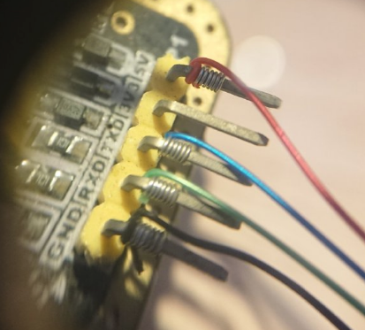
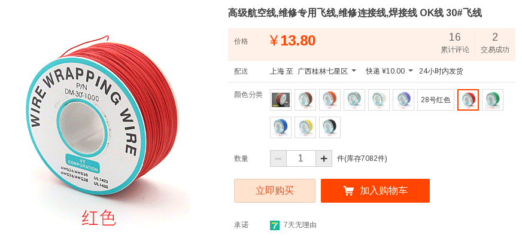

---

wire wrpa绕线工艺(图via [interrgned)](https://weibo.com/interrgned)

接线时代的工艺, 现在电子上已经很少用了

## 相关工具

* OK牌 手动绕线笔
* OK线 维修飞线 焊接线 航空线

## wiki

>  via: wiki <https://en.wikipedia.org/wiki/Wire_wrap>

绕线结构可以生产比印刷电路更可靠的组件：由于基板上的振动或物理应力，连接不易发生故障，并且缺少焊料可防止焊接故障，例如腐蚀，焊锡过热或过冷。

绕线结构在电路板制造中于1960年左右开始流行，现在使用量急剧下降。表面贴装技术使该技术的使用效率低于前几十年。无焊料面包板和专业制造的PCB的成本降低几乎消除了这项技术。

