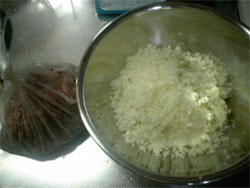

---

牛肉饼，尝试做了一次味道不错，然而太耗时间，主要是把材料都剁碎混合比较麻烦。吃多了也有点腻毕竟算油炸食品，感觉如果有厨房纸把油吸一吸会好点。

> via : http://www.cafenavijp.com/hanba-gu.htm

## **ふわふわハンバーグの作り方/レシピ**

家庭でも人気の高いハンバーグ。しかし、美味しいハンバーグを作るにはいくつかのコツがあります。ここでは、ふわふわハンバーグの作り方を紹介します。

材料　（４人前） （ここでの写真はすべてレシピの倍の分量になっています）

| 合挽き肉（牛７：豚３） | ４０ |
| ------------------------------------------------------------ | -------------------------------- |
| 塩 | ４ｇ     |
| 玉ねぎ                                               | ２５０ｇ           |
| パン粉 | ５０ｇ |
| 卵 | １個 |
| コショウ | 適量 |

１．最初に玉ねぎをミジン切りにして色付くまでよく炒め、ボールへ取り出して荒熱をとります。

玉ねぎを炒めるのは、ハンバーグは蒸し焼きなので玉ねぎの水分を飛ばして焼きやすくする為と、甘味を引き出す為です。

２．挽肉に対して１％の塩を入れ、手早く練ります。２～３分を目標に、よく練りましょう。塩はタンパク質を分解し、つなぎの役割をします。

　

３．パン粉に適量の水を加え、ふやかしてからよく絞ります。水のかわりに牛乳でもかまいません。

　

４．すべての材料を練り合わせます。ナツメグなど、好みの香辛料があればここで加えます。ここでも手早く練りましょう。

　

５．４等分して両手でキャッチボールしながら空気を抜き、形を整えます。

６．焼く前にパン粉を両側に付け、余分なパン粉は払い除けます。このときに付けるパン粉はコゲ目を付けやすくするためのものなので、ほんの少し付けるイメージで余分なパン粉は必ず叩いて除けて下さい。

パン粉が付き過ぎるとメンチカツになってしまいます。

焼くときには真ん中をヘコまし、型崩れを防ぐ為に必ずヘコんだ方から先に焼きます。火加減は中火です。油臭さをとる為に、油もよく熱しておきます。

　

７．スグにフタをして蒸し焼きにし、中火のまま焼きます。片面がシッカリ焼けたら引っくり返し、またスグにフタをして反対側を焼きます。

最後に火加減を若干強くして、両側の表面をカラッと焼き揚げます。

　

**作り方のポイント**

玉ねぎは細かいミジン切りにします。肉と玉ねぎの間に隙間を作らないようにする為です（肉汁の流出を防ぎます）。

肉はよく練ります。練りが甘いと肉汁が流れ出て、ボソボソしたハンバーグになります。

パン粉は肉汁を吸うように、水をよく絞っておきましょう。

ハンバーグは真ん中をヘコまして焼きます。焼くと肉が縮んで真ん中が膨らむので、焼きやすくする為（生焼けを防ぐ）です。

厚みは１．５～２cmぐらいがベストです。薄すぎると肉汁が中に留まることができず、厚すぎると火の通りが遅くなり、結果的に肉汁が流出します。

空気はよく抜き、表面はできるだけ滑らかに整えて裂け目などをなくします。肉汁を包み込む為と、型崩れを防ぎます。

最後のパン粉は焼き目を付けるためなので少量です。カリッとした食感が必要なければ付けなくてもかまいません。

食感のアクセントとしては、粗く刻んだタマネギを最後に少量入れてシャクッとした食感を足しても美味しいです。

できるだけ短時間で焼き上げる為に、中火～中弱火をキープして焼き上げます。肉汁の流出を防ぐ為です。

油は少し多めにします。最後に表面をカラッと揚げる為です。

途中できるだけ裏返さないようにし、フライパン返しなどでハンバーグを叩かない（押し付けない）ようにします。これも肉汁の流出を抑える為です。

最小限の裏返しと、最後にカラッと表面を焼き揚げる（揚げるイメージで）のがポイントです。外側がカリッと、内側がジューシーなハンバーグに仕上がります。

たまによく練らずにやわらかいハンバーグと言われることがありますが、それは空気の入ったやわらかさで、ハンバーグのやわらかさとは関係ありません。

また、肉汁の流出が早くなるのでボソボソになります。

卵とパン粉がつなぎと言われることもありますが、卵は滑らかさを出す為で（口当たりを良くする）、パン粉は肉汁を吸う為とやわらかさを作ります。

パン粉は少し粉っぽく感じるようだと量を減らして調整します。弾力のある肉の食感を楽しみたい場合もパン粉の量を減らします。

最後の決め手は好みで調整し、自己流ハンバーグレシピを完成させましょう。