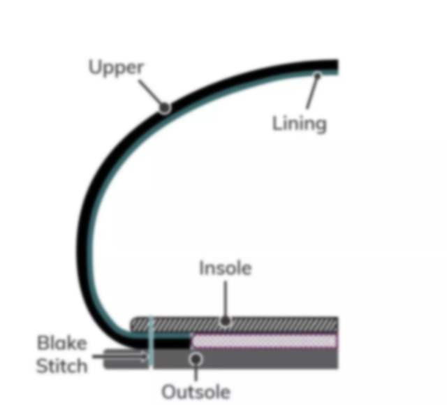
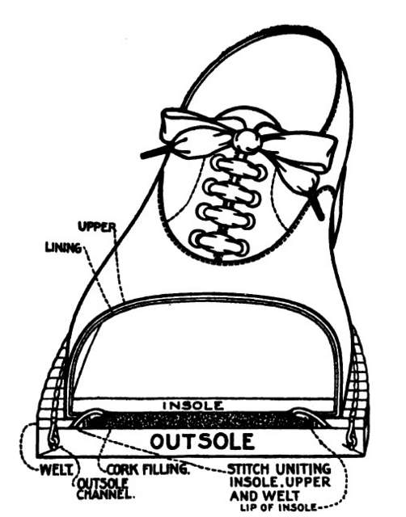
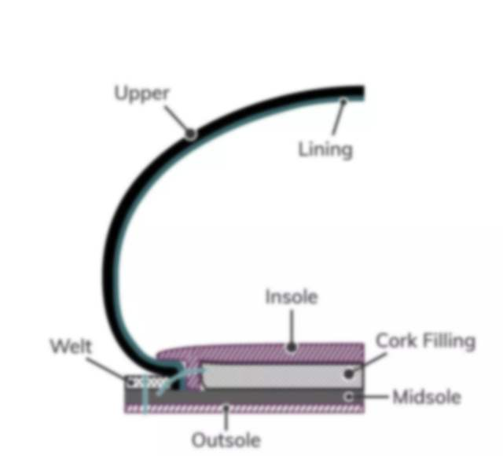
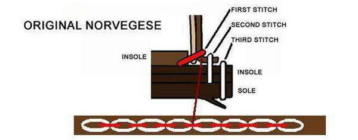

# 鞋的缝制工艺

> refers:
>
> - https://zhuanlan.zhihu.com/p/20035341
> - https://www.bilibili.com/read/cv10791503

## 粘胶鞋

工业量产常见工艺，就是用粘胶把底粘上。

## 内缝工艺

传统工艺，比较轻便，鞋面向内翻后直接缝在鞋底上，不需要使用沿条等附属部件，鞋底就可以做得比较薄，且可贴著鞋面裁切。

比粘胶鞋耐穿，但换底不易。

一条缝线‘Blake Stich’把鞋底和鞋帮缝在一起。

## 延条结构鞋

- 鞋身（Upper），内底（Insole）和大底（Sole）都是缝制在延条（Welt）上的
- cork filling 是填充软木，吸湿透气，还起到类似于‘弹簧’作用，给脚掌在走路时提供缓冲空间

## 固特异鞋

机器缝的延条结构的鞋子：

- 首先它是延条鞋，有‘延条Welt’。作为‘衔接’装置，把鞋帮、鞋底、内底缝在一起
- ‘Goodyear - 固特异’机器缝制。

可见‘Welt -沿条’和‘Insole -内底’固定，也和‘Midsole - 中底’、‘Outsole -大底’固定

只有 Goodyear 的流程在工厂内以机器生产的延条结构鞋子才是固特异鞋（Goodyear Welt Shoes）而真正手工缝制的则只是“延条结构鞋”（Welt Construction Shoes）。而工具的不同也就带来了机构上的一些变化，缝纫机毕竟不如人手灵巧，对缝制角度的要求就比较严苛，所以使用固特异机器缝制的延条鞋必须在内底外侧和延条之间黏贴一条帆布条然后再缝。

## 挪威缝

意大利人搞出来的复杂工艺..

# 鞋的材料

## 皮革

## 人造革

PVC、PU皮都是人造革

超细纤维合成革=真头层皮和真二层皮的边角料打碎后加入聚乙烯材料重新贴合

## 头层牛皮/牛皮革

- 割下来的牛皮，一般都比较厚（约45mm），可以撕开，得到两张皮；外边那一层是粒面皮，品质高的做光面皮，品质低的做成磨面牛皮；剩下的皮，从肉那一面隔开的，会做成反绒皮；另外一面，则会进行打磨镀层（为了牛皮纹路），就是二层牛皮了
- 粒面皮 > 修面皮 > 软面皮 > 碎皮（拼接后需要进行喷漆和抛光）
- 头层牛皮，透气性好过二层牛皮

### 关于“麂皮”

“麂皮”，从字面上理解也就是动物麂的皮革。具有粒面伤残较多，厚实，纤维组织紧密等特征。一般来说，麂皮也就的加工成“绒面革”的。然后后来，因为麂的数量实在是不多，便开始采用山羊皮、绵羊皮、鹿皮甚至是牛皮加工成绒面皮来替代麂皮的。所以呢，久而久之，麂皮也就成了“绒面皮”的代表词。

麂皮=绒面革，绒面革⊃磨面牛皮，绒面革⊃反绒皮

### 磨面牛皮/磨砂皮/Nubuck/牛巴戈

品质低的粒面皮，经过打磨之后，达到绒面触摸感，皮身厚实而柔软、表面色泽、绒毛、皮纹自然而成、不讲究对称和一致性。

### 反绒皮/Suede

反绒皮的原料是成年的牛，所以

