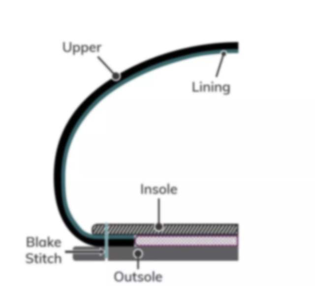
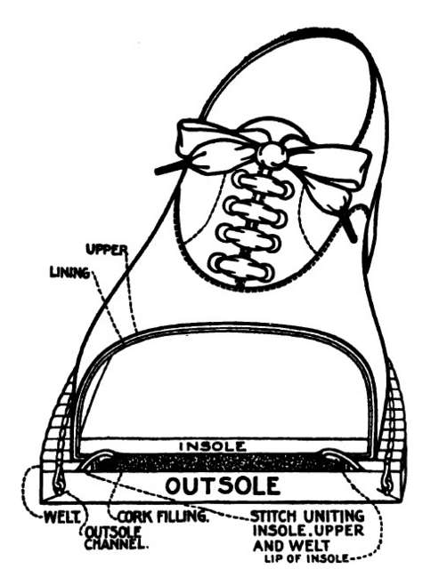
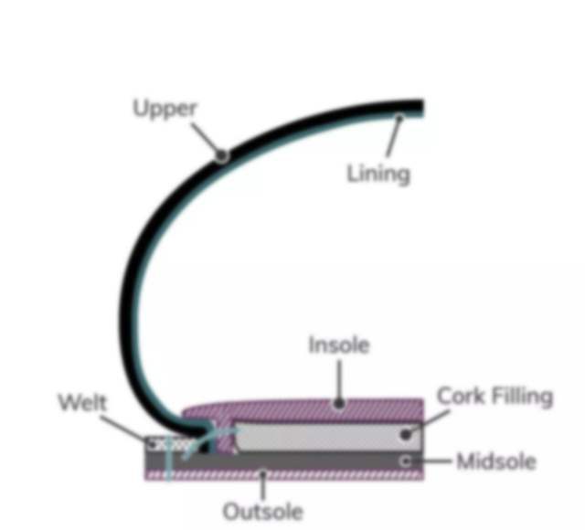
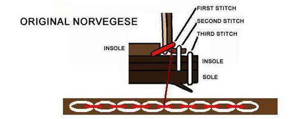

> refers:
>
> - https://zhuanlan.zhihu.com/p/20035341

## 粘胶鞋

工业量产常见工艺，就是用粘胶把底粘上。

## 内缝工艺

传统工艺，比较轻便，鞋面向内翻后直接缝在鞋底上，不需要使用沿条等附属部件，鞋底就可以做得比较薄，且可贴著鞋面裁切。

比粘胶鞋耐穿，但换底不易。

一条缝线‘Blake Stich’把鞋底和鞋帮缝在一起。

## 延条结构鞋

- 鞋身（Upper），内底（Insole）和大底（Sole）都是缝制在延条（Welt）上的
- cork filling 是填充软木，吸湿透气，还起到类似于‘弹簧’作用，给脚掌在走路时提供缓冲空间

## 固特异鞋

机器缝的延条结构的鞋子：

- 首先它是延条鞋，有‘延条Welt’。作为‘衔接’装置，把鞋帮、鞋底、内底缝在一起
- ‘Goodyear - 固特异’机器缝制。

可见‘Welt -沿条’和‘Insole -内底’固定，也和‘Midsole - 中底’、‘Outsole -大底’固定

只有 Goodyear 的流程在工厂内以机器生产的延条结构鞋子才是固特异鞋（Goodyear Welt Shoes）而真正手工缝制的则只是“延条结构鞋”（Welt Construction Shoes）。而工具的不同也就带来了机构上的一些变化，缝纫机毕竟不如人手灵巧，对缝制角度的要求就比较严苛，所以使用固特异机器缝制的延条鞋必须在内底外侧和延条之间黏贴一条帆布条然后再缝。

## 挪威缝

意大利人搞出来的复杂工艺..

