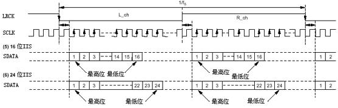

## 典型I2S时序（飞利浦模式）



- 高位在前（MSB）
- 右对齐（Right-aligned）
- LRCK，低电平为L


## 用python分析i2s中的波形

调试时常用逻辑分析仪抓取i2s波形，输入一个正弦波后采出后绘图，这里是一个绘图的程序：

```
import numpy as np
import matplotlib.pyplot as plt
import csv
import struct

'''
CSV fomat:
1.558804150,2,0x0003
1.558815500,1,0xFFF7
1.558826850,2,0x0007
'''

x_list = []
y_list = []
with open('i2s.csv') as f:
    rows = csv.reader(f)
    rows.__next__() # skip first line

    for row in rows:
        time  = row[0]
        ch    = row[1]
        value = int(row[2], 10)
        value = (value & ((1 << 15) - 1)) - (value & (1 << 15))
        if ch == '2':
            x_list.append(float(time))
            y_list.append(value)
            # print(float(time), value)

# x = np.array(x_list)0
x = np.arange(0, len(y_list))
y = np.array(y_list)

x = x[2000:2200]
y = y[2000:2200]
plt.plot(x, y)
plt.show()
```

