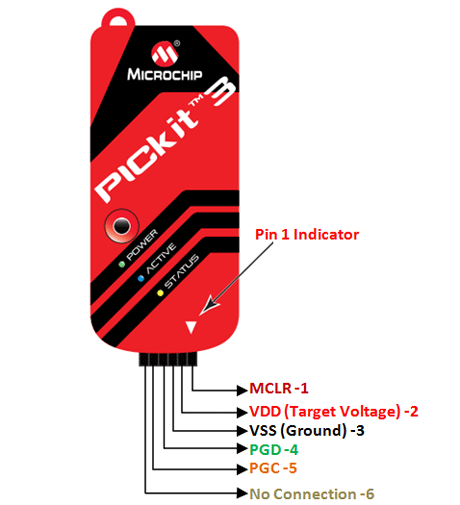

---

## JTAG SWD接口

所谓的两线制JTAG（TCK/TIO）对应的就是SWD的管脚（SWDCLK/SWDIO）

## JTAG接线

<<<<<<< Updated upstream
## pickit3

|                |               |                                                              |
| -------------- | ------------- | ------------------------------------------------------------ |
| **Pin Number** | **Pin Name**  | **Description**                                              |
| 1              | MCLR/Vpp      | Connected to Master clear external reset pin of PIC to reset the MCU before programming |
| 2              | VDD (Target)  | Target voltage of PIC, 5V or 3.3V                            |
| 3              | Ground        | Ground pin of the system                                     |
| 4              | PGD/ICSPDAT   | Program Data(PDG) is connected to the In Circuit Serial Programming (ICSP) data pin |
| 5              | PGC/ICSPCLK   | Program Clock (PGC) is connected to In Circuit Serial Programming (ICSP) clock pin |
| 6              | No connection |                                                              |
=======
## 3.5mm JACK音频接口

>>>>>>> Stashed changes
