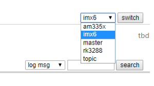
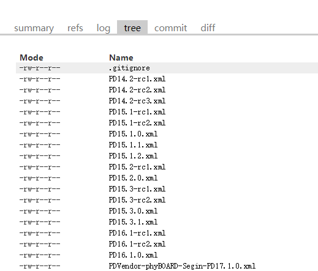

关于yocto：

> Yocto refers:
>
> - 官方版本库 https://git.yoctoproject.org/poky
> - yocto与bitbake版本的对应关系 https://wiki.yoctoproject.org/wiki/Releases
> - yocto的手册：https://docs.yoctoproject.org/index.html
>
> Bitbike refers:
>
> - 用户手册 https://docs.yoctoproject.org/1.6/bitbake-user-manual/bitbake-user-manual.html
> - [BitBake 实用指南](http://sunyongfeng.com/201610/programmer/yocto/Bitbake_practical_guide.html) 关于recipe编写的方法

## bitbake

### 在.bbappend所在目录中添加资源文件

> via: https://stackoverflow.com/questions/50743109/yocto-bitbake-path-variable-for-append-file-directory

```
FILESEXTRAPATHS_prepend := "${THISDIR}:"
SRC_URI += "file://yourfile"
do_install_append(){
      install -d ${D}/some-dest-dir
      install -m 0644 ${S}/yourfile ${D}/some-dest-dir/
}
```

### 添加任务

方法1，用addtask：

```
do_make_scr() {
    ./tool/mkimage -A arm -T script -O linux -d boot.txt boot.scr
    kdjfd
}

addtask make_scr after do_compile before do_deploy
```

方法2，直接添加`xxx_append`或者`xxx_prepend`函数：

```
do_install_append() {
    install -d ${D}${datadir}/applications
    install -d ${D}${datadir}/pixmaps
    install -d ${D}${libdir}/${PN}/defaults/pref
    ...
}
```

## 关于`tmp/work/????/{recipe}/{ver}/`下的文件


- build：
- 


## bitbake问题集

### `No valid terminal found, unable to open devshell.`

```bash
$ apt install tmux

## 强制重新执行


```
bitbake linux-mys6ulx -c compile -f
```


## 在一个recipe中添加多个initscripts，用update-rc.d类

> refer: http://www.embeddedlinux.org.cn/OEManual/update-rc-d_class.html

```
# 分多个子包，并让${PN}包依赖子包
PACKAGES =+ "${PN}-fix-eth-mac ${PN}-mount-user"
RDEPENDS_${PN} = "${PN}-fix-eth-mac ${PN}-mount-user"

inherit update-rc.d

INITSCRIPT_PACKAGES = "${PN} ${PN}-fix-eth-mac ${PN}-mount-user"

INITSCRIPT_NAME_${PN} = "rc.local"
INITSCRIPT_PARAMS_${PN} = "start 99 2 3 4 5 ."

INITSCRIPT_NAME_${PN}-fix-eth-mac = "fix-eth-mac"
INITSCRIPT_PARAMS_${PN}-fix-eth-mac = "start 10 2 3 4 5 ."

INITSCRIPT_NAME_${PN}-mount-user = "mount-user-partition"
INITSCRIPT_PARAMS_${PN}-mount-user = "start 02 S ."

# 记得添加这些文件，让他们存在于package中
FILES_${PN} = " \
    ${sysconfdir}/ \
    ${sysconfdir}/init.d/rc.local \
"
FILES_${PN}-fix-eth-mac = "${sysconfdir}/init.d/fix-eth-mac"
FILES_${PN}-mount-user = "${sysconfdir}/init.d/mount-user-partition"

```


## yocto查询各类信息方法指南

> via: https://www.cnblogs.com/liushuhe1990/articles/13218041.html

### 查找可以编译的image和machine名称

以下指令都在source下执行。

查找image：

```
find . -name "*image*.bb"
```


查找可用的machine名称

```
find . -name "*.conf" | grep machine

```

### 查找bitbake中各个包可用的指令

使用以下指令：

```
bitbake [package] -c listtasks
```

显示package的可以执行的指令列表，

### 查找buildlog（编译等日志）的位置

下面这个是kernel的buildlog

build/tmp/work/phyflex_imx6_2-phytec-linux-gnueabi/linux-mainline/4.1.36-phy3-r0.0/temp

**文件夹内容** 

```
bob@debian8:~/bsp/imx6dq/BSP-Yocto-i.MX6-PD16.1.0/build/tmp/work/phyflex_imx6_2-phytec-linux-gnueabi/linux-mainline/4.1.36-phy3-r0.0/temp$ ls -al |grep "\->"
lrwxrwxrwx  1 bob bob     29 Sep 28 18:46 log.do_bundle_initramfs -> log.do_bundle_initramfs.13961
lrwxrwxrwx  1 bob bob     20 Sep 28 18:44 log.do_compile -> log.do_compile.29123
lrwxrwxrwx  1 bob bob     33 Sep 28 18:45 log.do_compile_kernelmodules -> log.do_compile_kernelmodules.2154
lrwxrwxrwx  1 bob bob     22 Sep 28 17:54 log.do_configure -> log.do_configure.30651
lrwxrwxrwx  1 bob bob     19 Sep 28 18:46 log.do_deploy -> log.do_deploy.13997
lrwxrwxrwx  1 bob bob     18 Sep 28 17:53 log.do_fetch -> log.do_fetch.30628
lrwxrwxrwx  1 bob bob     20 Sep 28 18:46 log.do_install -> log.do_install.13394
```

请注意在这个路径中

- phyflex_imx6_2-phytec-linux-gnueabi
- linux-mainline
- 4.1.36-phy3-r0.0

为平台相关，请按照你的平台来查找。


### 查找内核的.config文件位置

在编译完成后，会在deploy文件夹生成一个config文件，如

**文件夹内容** 

```
bob@debian8:~/bsp/imx6dq/BSP-Yocto-i.MX6-PD16.1.0/build/deploy/images/phyflex-imx6-2$ ls *.config -al
lrwxrwxrwx 1 bob bob     64 Sep 29 09:19 barebox.config -> barebox-phyflex-imx6-2-2016.11.0-phy4-r7.0-20170929011538.config
-rw-r--r-- 2 bob bob  16593 Sep 29 09:19 barebox-phyflex-imx6-2-2016.11.0-phy4-r7.0-20170929011538.config
lrwxrwxrwx 1 bob bob     75 Sep 28 18:46 zImage.config -> zImage-linux-mainline-4.1.36-phy3-r0.0-phyflex-imx6-2-20170928104525.config
-rw-r--r-- 2 bob bob 120665 Sep 28 18:46 zImage-linux-mainline-4.1.36-phy3-r0.0-phyflex-imx6-2-20170928104525.config

```

其中的 zImage.config 文件就是kernel的 config。

编译时，kernel使用的config位于

build/tmp/work/phyflex_imx6_2-phytec-linux-gnueabi/linux-mainline/4.1.36-phy3-r0.0/build/.config

**文件夹内容** 

```
root@debian8:/home/bob/bsp/imx6dq/BSP-Yocto-i.MX6-PD16.1.0/build/tmp/work/phyflex_imx6_2-phytec-linux-gnueabi/linux-mainline/4.1.36-phy3-r0.0/build# ls -al
total 380
drwxr-xr-x 3 bob bob   4096 Sep 29 10:40 .
drwxr-xr-x 4 bob bob   4096 Sep 29 10:39 ..
-rw-r--r-- 1 bob bob 120665 Sep 29 10:39 .config
-rw-r--r-- 1 bob bob 120665 Sep 29 10:39 .config.old
-rw-r--r-- 1 bob bob 120665 Sep 29 10:39 .config.orig
-rw-r--r-- 1 bob bob    752 Sep 29 10:39 Makefile
-rw-r--r-- 1 bob bob      0 Sep 29 10:39 .scmversion
drwxr-xr-x 4 bob bob   4096 Sep 29 10:39 scripts
lrwxrwxrwx 1 bob bob     96 Sep 29 10:39 source -> /home/bob/bsp/imx6dq/BSP-Yocto-i.MX6-PD16.1.0/build/tmp/work-shared/phyflex-imx6-2/kernel-source
```

### 查找文件系统中某个文件是属于哪个软件包/某个软件包包含哪些文件

使用以下指令

```
% oe-pkgdata-util find-path /usr/lib/xorg/modules/input/tslib_drv.so
xf86-input-tslib: /usr/lib/xorg/modules/input/tslib_drv.so
```

可以看出 /usr/lib/xorg/modules/input/tslib_drv.so 这个文件是属于 xf86-input-tslib 这个软件包。

oe-pkgdata-util还有其他一些功能，可以查看它的帮助。如查找某个软件包会在文件系统部署哪些文件：

```
% oe-pkgdata-util list-pkg-files xf86-input-tslib
xf86-input-tslib:
        /lib/udev/rules.d/99-xf86-input-tslib.rules
        /usr/lib/xorg/modules/input/tslib_drv.so
        /usr/share/hal/fdi/policy/20thirdparty/10-x11-input-tslib.fdi
```

### 查找包之间的依赖关系

首先用下面的命令生成dot格式的依赖树。

```
bitbake -g [镜像名称]
```

此时在build下生成3个文件

| 文件名             | 内容                                        |
| ------------------ | ------------------------------------------- |
| pn-buildlist       | 包列表                                      |
| task-depends.dot   | yocto执行的task（如xxx.do_fetch）的依赖关系 |
| recipe-depends.dot | 包的依赖关系                                |


然后下载 oe-depends-dot 文件，这个文件是2018年5月份新增的，因此老的yocto中不包含此文件，需要下载，请在 https://github.com/openembedded/openembedded-core/blob/master/scripts/oe-depends-dot 这里点raw按钮获得下载链接。

然后将这个文件复制到 sources/poky/scripts/ 中，再加上可执行权限。

```
wget https://raw.githubusercontent.com/openembedded/openembedded-core/master/scripts/oe-depends-dot
chmod +x oe-depends-dot
```

接下来就可以在build目录下执行 oe-depends-dot 文件来查找依赖关系，具体方法请查看 -h 帮助。

```
% oe-depends-dot --help
usage: oe-depends-dot [-h] [-k KEY] [-d] [-w] [-r] dotfile

Analyse recipe-depends.dot generated by bitbake -g

positional arguments:
  dotfile            Specify the dotfile

optional arguments:
  -h, --help         show this help message and exit
  -k KEY, --key KEY  Specify the key, e.g., recipe name
  -d, --depends      Print the key's dependencies
  -w, --why          Print why the key is built
  -r, --remove       Remove duplicated dependencies to reduce the size of the
                     dot files. For example, A->B, B->C, A->C, then A->C can
                     be removed.

Use oe-depends-dot --help to get help
```

以下举例，查找为何image中包含iperf3

```
% oe-depends-dot -k iperf3 -w recipe-depends.dot
Because: packagegroup-benchmark phytec-headless-image
phytec-headless-image -> packagegroup-benchmark -> iperf3
```

查找iperf3依赖哪些包

```
% oe-depends-dot -k iperf3 -d recipe-depends.dot
Depends: linux-libc-headers autoconf-native binutils-cross-arm pseudo-native gcc-runtime libtool-cross quilt-native libgcc glibc prelink-native automake-native gcc-cross-arm opkg-utils-native gnu-config-native libtool-native rpm-native
```

###  查找各个软件包在文件系统中的大小

在yocto的 build/buildhistory/image/[机器名]/glibc/[image名称]/ 中，有一个 installed-package-sizes.txt 文件，该文件列出了文件系统中安装的所有软件按大小排列，如：

```
  1 86410   KiB html5demo
  2 71245   KiB qtwebengine
  3 25071   KiB libicudata57
  4 17800   KiB qtbase
  5 11381   KiB qtvirtualkeyboard
  6 11174   KiB node-upm
  7 10817   KiB nodejs
  8 10260   KiB binutils
  9 9349    KiB nodejs-npm
 10 8766    KiB linux-firmware-wl12xx
...
```

 

同一个目录下还有一个 files-in-image.txt 文件，该文件列出了文件系统中所有文件的位置于大小以及权限。当然这个信息用treesize来分析编译生成的文件系统压缩包会更直观一点儿。

### 查询内核/barebox/或其他软件的版本

#### 方法1（适合在有yocto bsp环境的情况下查看）

本方法参考这里写成：

http://www.phytec.de/documents/l-813e-5-yocto-reference-manual/#How_to_know_your_Kernel_and_Bootloader_Recipe_and_Version

首先，确定kernel的包名称，以下以PD17.1.2的imx6ul为例。

```
% bitbake virtual/kernel -e | grep "PREFERRED_PROVIDER_virtual/kernel"
# $PREFERRED_PROVIDER_virtual/kernel_mx6ul
PREFERRED_PROVIDER_virtual/kernel_mx6ul="linux-imx"
# $PREFERRED_PROVIDER_virtual/kernel [2 operations]
PREFERRED_PROVIDER_virtual/kernel="linux-imx"
% bitbake virtual/bootloader -e | grep "PREFERRED_PROVIDER_virtual/bootloader"
# $PREFERRED_PROVIDER_virtual/bootloader
PREFERRED_PROVIDER_virtual/bootloader="barebox"
```

以上可以看到bootloader为barebox，kernel为linux-imx，下面查找kernel的版本：

```
% bitbake -s | grep "linux-imx"
linux-imx                                   :4.1.15-phy3-r0.0
```

bootloader的版本：

```
% bitbake -s | grep "barebox"
barebox                                  :2017.04.0-phy3-r7.0
```

也就是说kernel的git tag为4.1.15-phy3，barebox 为 2017.04.0-phy3。

用这个方法也可以查看其他软件的版本，如QT，busybox。

```
% bitbake -s | grep "qtbase"
nativesdk-qtbase                    :5.7.1+gitAUTOINC+a55f36211e-r0
qtbase                              :5.7.1+gitAUTOINC+a55f36211e-r0
qtbase-native                       :5.7.1+gitAUTOINC+a55f36211e-r0
% bitbake -s | grep "busybox"
busybox                                            :1.24.1-r0
```

####  方法2（不需要yocto环境）

我们的所有源代码都是放在

https://git.phytec.de/

里的，在初始化BSP时，使用的是 phy2octo 工具。

https://git.phytec.de/phy2octo

在这个repo中，可以切换到对应版本的branch，比如imx6



接下来在tree中就可以看到这个branch的源代码

https://git.phytec.de/phy2octo/tree/?h=imx6



打开对应版本的xml文件，就可以看到该版本的BSP包对应的其他layer是哪个版本的，从中就可以查到具体的软件是哪个版本。

https://git.phytec.de/phy2octo/tree/PD16.1.0.xml?h=imx6

```
<?xml version='1.0' encoding='UTF-8'?>
<manifest>
  <phytec pdn="PD16.1.0" release_uid="BSP-Yocto-i.MX6-PD16.1.0" soc="iMX6" />

  <remote fetch="git://git.phytec.de" name="git.phytec" />
  <remote fetch="git://github.com" name="github" />
  <remote fetch="git://git.openembedded.org" name="oe" />
  <remote fetch="ssh://git@git.phytec.de" name="ssh.phytec" />
  <remote fetch="git://git.ti.com" name="ti" />
  <remote fetch="git://git.yoctoproject.org" name="yocto" />

  <default remote="git.phytec" revision="krogoth" sync-j="8" />        yocto代号

  <project name="meta-openembedded" path="sources/meta-openembedded" remote="oe" revision="55c8a76da5dc099a7bc3838495c672140cedb78e" />
  <project name="meta-phytec" path="sources/meta-phytec" revision="refs/tags/2.1.2-phy4">    这里是2.1.2-phy4版本，这个layer中包含了kernel
    <copyfile dest="tools/init" src="scripts/init" />
  </project>
  <project name="meta-qt5/meta-qt5" path="sources/meta-qt5" remote="github" revision="2b1871f0d139dc3caaa779a32a1931409c245a36" />
  <project name="meta-yogurt" path="sources/meta-yogurt" revision="refs/tags/2.1.2-phy4" />
  <project name="poky" path="sources/poky" remote="yocto" revision="refs/tags/yocto-2.1.2" />
</manifest>
```

那么我们以kernel为例子，打开meta-phytec的 2.1.2-phy4版本

https://git.phytec.de/meta-phytec/tree/recipes-kernel/linux?h=2.1.2-phy4

在 recipes-kernel/linux/[linux-mainline_4.1.36-phy3.bb](http://linux-mainline_4.1.36-phy3.bb/) 中可以找到kernel的bb文件。

https://git.phytec.de/meta-phytec/tree/recipes-kernel/linux/linux-mainline_4.1.36-phy3.bb?h=2.1.2-phy4

 

```
# Copyright (C) 2015 PHYTEC Messtechnik GmbH,
# Author: Stefan Christ <s.christ@phytec.de>

inherit phygittag
inherit buildinfo
include linux-common.inc

GIT_URL = "git://git.phytec.de/${PN}"
SRC_URI = "${GIT_URL};branch=${BRANCH}"

PR = "${INC_PR}.0"

# NOTE: PV must be in the format "x.y.z-.*". It cannot begin with a 'v'.
# NOTE: Keep version in filename in sync with commit id!
SRCREV = "2daddfb77a87b8353fdd06ce548c5ae8ca5f9c0a"

S = "${WORKDIR}/git"

COMPATIBLE_MACHINE  =  "phyflex-imx6-1"
COMPATIBLE_MACHINE .= "|phyflex-imx6-2"
COMPATIBLE_MACHINE .= "|phyflex-imx6-3"
COMPATIBLE_MACHINE .= "|phyflex-imx6-4"
COMPATIBLE_MACHINE .= "|phyflex-imx6-5"
COMPATIBLE_MACHINE .= "|phyflex-imx6-6"
COMPATIBLE_MACHINE .= "|phyflex-imx6-7"
COMPATIBLE_MACHINE .= "|phyflex-imx6-8"
COMPATIBLE_MACHINE .= "|phyflex-imx6-9"
COMPATIBLE_MACHINE .= "|phyflex-imx6-10"

COMPATIBLE_MACHINE .= "|phycard-imx6-1"
COMPATIBLE_MACHINE .= "|phycard-imx6-2"

COMPATIBLE_MACHINE .= "|phyboard-alcor-imx6-1"
COMPATIBLE_MACHINE .= "|phyboard-subra-imx6-1"
COMPATIBLE_MACHINE .= "|phyboard-subra-imx6-2"

COMPATIBLE_MACHINE .= "|phyboard-mira-imx6-3"
COMPATIBLE_MACHINE .= "|phyboard-mira-imx6-4"
COMPATIBLE_MACHINE .= "|phyboard-mira-imx6-5"
COMPATIBLE_MACHINE .= "|phyboard-mira-imx6-6"
COMPATIBLE_MACHINE .= "|phyboard-mira-imx6-7"
COMPATIBLE_MACHINE .= "|phyboard-mira-imx6-9"
COMPATIBLE_MACHINE .= "|phyboard-mira-imx6-10"
COMPATIBLE_MACHINE .= "|phyboard-mira-imx6-11"
COMPATIBLE_MACHINE .= "|phyboard-mira-imx6-12"
```

可以从下面的COMPATIBLE_MACHINE 看出他就是对应的imx6 soc的bb文件。

那么对应的linux版本就是 4.1.36-phy3，然后在

https://git.phytec.de/linux-mainline/

的tag中，就可以找到这个版本的kernel source

https://git.phytec.de/linux-mainline/tag/?h=v4.1.36-phy3

### 查找machine对应的设备树dts文件名与位置

在 sources/meta-phytec/conf/machine 中找到 build/conf/local.conf 定义的 MACHINE 变量 对应的 .conf 文件。

local.conf文件：

```
MACHINE ?= "phyboard-mira-imx6-3"

DISTRO ?= "yogurt"
```

machine 目录：

```
nzhang@Z220:~/bsp/mx6/PD16.1.1/sources/meta-phytec/conf/machine$ ls
beagleboneblack-1.conf      phyboard-mira-imx6-9.conf       phycore-am335x-1.conf     phycore-rk3288-1.conf
firefly-rk3288-1.conf       phyboard-regor-am335x-1.conf    phycore-am335x-2.conf     phycore-rk3288-2.conf
include                     phyboard-segin-imx6ul-1.conf    phycore-am335x-3.conf     phyflex-imx6-10.conf
phyboard-alcor-imx6-1.conf  phyboard-subra-imx6-1.conf      phycore-am335x-4.conf     phyflex-imx6-1.conf
phyboard-mira-imx6-10.conf  phyboard-subra-imx6-2.conf      phycore-am335x-5.conf     phyflex-imx6-2.conf
phyboard-mira-imx6-11.conf  phyboard-wega-am335x-1.conf     phycore-am335x-6.conf     phyflex-imx6-3.conf
phyboard-mira-imx6-12.conf  phyboard-wega-am335x-2.conf     phycore-am335x-7.conf     phyflex-imx6-4.conf
phyboard-mira-imx6-3.conf   phyboard-wega-am335x-3.conf     phycore-r2-am335x-1.conf  phyflex-imx6-5.conf
phyboard-mira-imx6-4.conf   phyboard-wega-am335x-4.conf     phycore-r2-am335x-2.conf  phyflex-imx6-6.conf
phyboard-mira-imx6-5.conf   phyboard-wega-r2-am335x-1.conf  phycore-r2-am335x-3.conf  phyflex-imx6-7.conf
phyboard-mira-imx6-6.conf   phycard-imx6-1.conf             phycore-r2-am335x-4.conf  phyflex-imx6-8.conf
phyboard-mira-imx6-7.conf   phycard-imx6-2.conf             phycore-r2-am335x-5.conf  phyflex-imx6-9.conf
```

然后打开该文件 phyboard-mira-imx6-3.conf

```
#@TYPE: Machine
#@NAME: phyboard-mira-imx6-3
#@DESCRIPTION: PHYTEC phyBOARD-Mira i.MX6 Quad, 1GiB RAM, NAND
#@ARTICLENUMBERS: PB-01501-002.A2, PBA-C-06-002.A2, PCM-058-33230C0I.A3
#@SUPPORTEDIMAGE: phytec-qt5demo-image

require conf/machine/include/phyimx6qdl.inc

SOC_FAMILY .= ":mx6q"
SOC_FAMILY .= ":phyboard-mira-imx6"

# Kernel
KERNEL_DEVICETREE = "imx6q-phytec-mira-rdk-nand.dtb"

# Barebox Config
BAREBOX_BIN = "images/barebox-phytec-phycore-imx6q-som-nand-1gib.img"

MACHINE_FEATURES += "resistivetouch pci can wifi"

SERIAL_CONSOLES = "115200;ttymxc1"

```

KERNEL_DEVICETREE变量定义了根DTS文件的名称。

接下来在kernel-source中的 arch/arm/boot/dts 目录中就可以找到对应的dts文件，注意在conf文件中定义的是dtb。

```
/*
 * Copyright (C) 2015 PHYTEC Messtechnik
 * Author: Christian Hemp <c.hemp@phytec.de>
 *
 * The code contained herein is licensed under the GNU General Public
 * License. You may obtain a copy of the GNU General Public License
 * Version 2 or later at the following locations:
 *
 * http://www.opensource.org/licenses/gpl-license.html
 * http://www.gnu.org/copyleft/gpl.html
 */

/dts-v1/;
#include "imx6q.dtsi"
#include "imx6qdl-phytec-phycore-som.dtsi"
#include "imx6qdl-phytec-mira.dtsi"
#include "imx6qdl-phytec-mira-peb-eval-01.dtsi"
#include "imx6qdl-phytec-mira-peb-av-02.dtsi"
#include "imx6qdl-phytec-peb-wlbt-01.dtsi"

/ {
        model = "Phytec phyBOARD-MIRA Quad Carrier-Board with nand";
        compatible = "phytec,imx6q-pbac06", "phytec,imx6qdl-pcm058", "fsl,imx6q";

        aliases {
                ipu1 = &ipu2;
        };
     
        chosen {
                linux,stdout-path = &uart2;
        };
};

&can1 {
        status = "okay";
};

&fec {
        status = "okay";
};
```

在这个文件中就可以看到整个machine的设备树。

### 检查yocto编译环境的变量

```
bitbake -e
```

这个指令的输出可以直接grep 或者用 > 输出到一个文件后打开查看。
