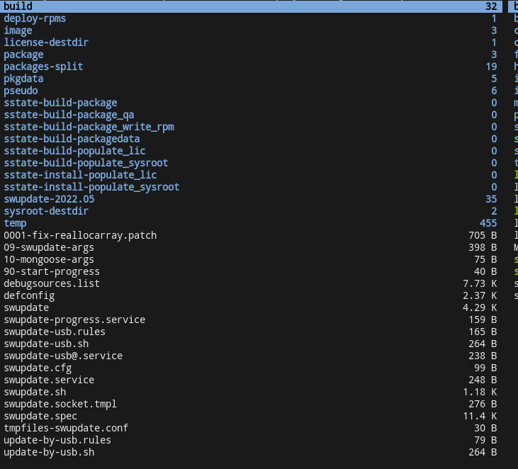

关于BitBake:

> refers:
> 
> - [BitBake 实用指南](http://sunyongfeng.com/201610/programmer/yocto/Bitbake_practical_guide.html) 关于recipe编写的方法
> - yocto的手册：https://docs.yoctoproject.org/index.html

## bitbake

### 在.bbappend所在目录中添加资源文件

> via: https://stackoverflow.com/questions/50743109/yocto-bitbake-path-variable-for-append-file-directory

```
FILESEXTRAPATHS_prepend := "${THISDIR}:"
SRC_URI += "file://yourfile"
do_install_append(){
      install -d ${D}/some-dest-dir
      install -m 0644 ${S}/yourfile ${D}/some-dest-dir/
}
```

### 添加任务

方法1，用addtask：

```
do_make_scr() {
    ./tool/mkimage -A arm -T script -O linux -d boot.txt boot.scr
    kdjfd
}

addtask make_scr after do_compile before do_deploy
```

方法2，直接添加`xxx_append`或者`xxx_prepend`函数：

```
do_install_append() {
    install -d ${D}${datadir}/applications
    install -d ${D}${datadir}/pixmaps
    install -d ${D}${libdir}/${PN}/defaults/pref
    ...
}
```


## 关于`tmp/work/????/{recipe}/{ver}/`下的文件




- build：
- 


## bitbake问题集

### `No valid terminal found, unable to open devshell.`

```bash
$ apt install tmux
```

