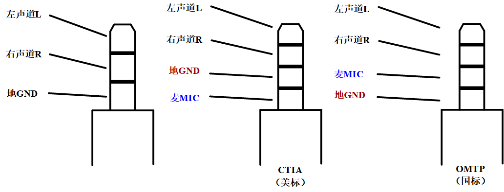
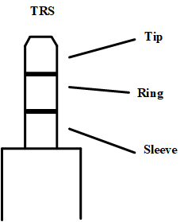
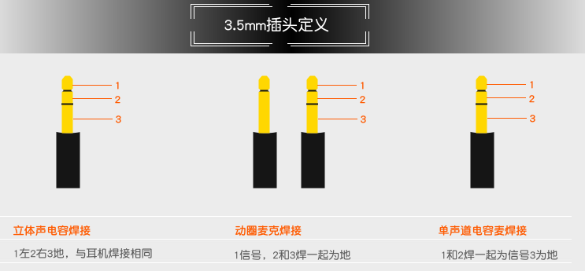
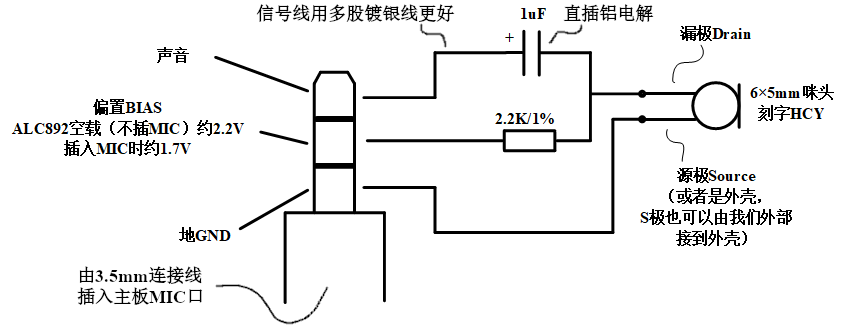

## TRS（Tip-Ring-Sleeve）耳机孔

> via: https://www.cnblogs.com/YangGuangPu/p/12785070.html

一、耳机插座（Phone Jack/Headphone Jack）

实际上，3.5mm插口又名TRS（Tip-Ring-Sleeve），只要明确这三个点，在实用不同的连接器座子时就可以分清楚了：（耳机/扬声器的TRS是左-右-地，麦克风的TRS是信号-偏置-地）

二、麦克风（MIC）的定义：

网上找的图：

还有一种实测有效的方案，适用于台式机电脑，或者CM108等等声卡独立出的MIC插口（而非手机、笔记本电脑上的4段式插口）：

