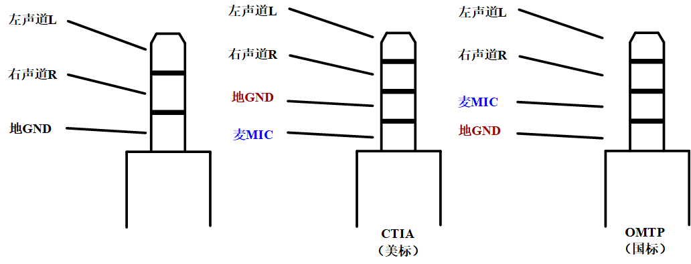

## TRS（Tip-Ring-Sleeve）孔

> via: https://www.cnblogs.com/YangGuangPu/p/12785070.html

一、耳机插座（Phone Jack/Headphone Jack）

实际上，3.5mm插口又名TRS（Tip-Ring-Sleeve），只要明确这三个点，在实用不同的连接器座子时就可以分清楚了：（耳机/扬声器的TRS是左-右-地，麦克风的TRS是信号-偏置-地）

二、麦克风（MIC）的定义：

> via: https://blog.csdn.net/tronteng/article/details/7034337

前置音频口的连接，耳机一般没有什么问题，麦克会经常出现问题，原因是有些机箱的前置麦克插座的接线方式不标准。下图列出了标准接线与非标准接线的区别：

标准的接线有三条线：地线、麦克输入、麦克偏置。非标准的有二条线：地线和麦克输入，把麦克偏置省了。非标准1是把插座1、3短接，非标准2是3脚空着。这两种的把MIC_IN接到JAUD1的1脚是可以使用的。非标准3是把2、3短接，这种插入标准插头的麦克肯定是没有声音的，除非也用那种与之相对应接法的非标准插头的麦克。

网上找的图：

还有一种实测有效的方案，适用于台式机电脑，或者CM108等等声卡独立出的MIC插口（而非手机、笔记本电脑上的4段式插口）：

## TRS音频规范参考

标准乱七八糟，可以参考Android手机的开放标准：

> 3.5 毫米耳机插孔：设备规范:https://source.android.google.cn/docs/core/interaction/accessories/headset/jack-headset-spec
>
> 3.5 毫米耳机：配件规范: https://source.android.google.cn/docs/core/interaction/accessories/headset/plug-headset-spec

## 音频Line-in/Mic-in，以及Line-out/HeadPhone接口区别

>  via: https://blog.csdn.net/tq384998430/article/details/72356914

**1、Line in端口**：该端口主要用于连接电吉他、电子琴、合成器等外界设备的音频信号输出的录音，由于这些设备本身输出功率就比较大，因此需要连接到Line in端口录音，当然使用它们录音从某种程度上也可以被称为外部设备的“内录”。一般您使用的声卡越好，Line in里的噪音就会越低，录制效果也会比较好。

**2、Mic in端口**：这要是连接麦克风录音使用的。但是这个端口和Line in的区别在于它有前置放大器，换言之麦克风本身输出功率小，因此必须要有一个外部的放大设备来放大音频信号。这个端口就是起到这个作用。有兴趣的朋友可以尝试一下把你的麦克风直接连接到Line in端口录音……没有声音或者声音很小对吧？！道理很简单，麦克风的信号没有被放大，自然效果就不好了。

3、Line Out输出的信号，是模拟音频信号，电平比较高，所以耳塞插上去可以听到声音，用户容易将他和手机的耳机接口混淆。
Line Out和手机的耳机接口区别是？ 首先大家都是模拟输出，都能输出模拟信号，直接用耳塞插上去都会有声音。区别在于，Line Out口输出的模拟信号是没有经过功放放大的信号，是芯片将数字信号转换成模拟信号后最原始的信号源，不包含额外的音染，当然，因为没经过放大，所以功率极小，难以推动耳机/耳塞（千万别认为声音大就是能推动哈）。而手机的耳机孔输出，也叫Phone Out，是经过手机内部数字转模拟信号后，再经过功放放大的信号，其功率比较大，可以直接推动耳塞/耳机。

## 关于Line-In & Lin-Out的电平

> via: https://en.wikipedia.org/wiki/Line_level

