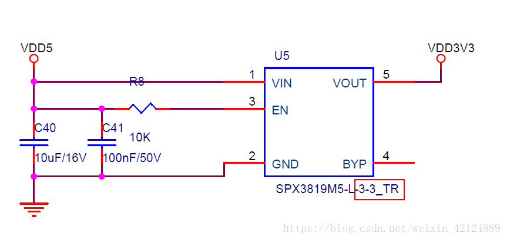
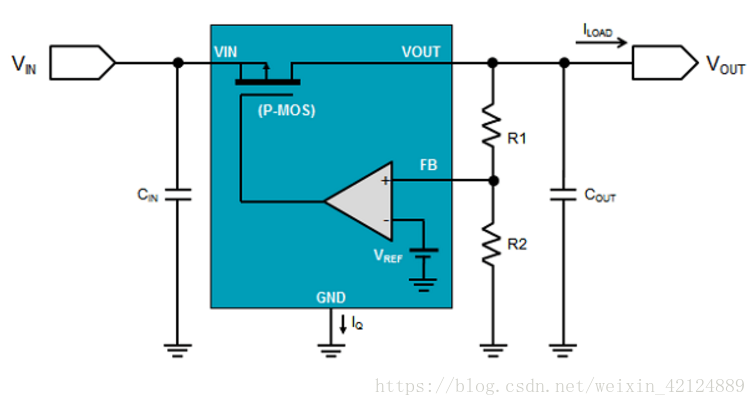
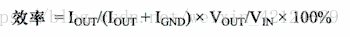

## LDO

### 介绍

一、前言
在一个电路板中，我们会用到各式各样的电压，一般我们获取这些电压的途径无非3点，一个从外部引入，做滤波隔离处理；另一个则是电路板内部转换，内部转换无非就是 用电源芯片管理芯片来转换所需要的电压。
一般我们使用的电源管理芯片无非就是LDO和DC-DC
今天我们来聊聊的是LDO。

LDO=low dropout regulator，低压差+线性+稳压器。
“低压差”：输出压降比较低，例如输入3.3V，输出可以达到3.2V。
“线性”：LDO内部的MOS管工作于线性电阻。
“稳压器”说明了LDO的用途是用来给电源稳压。

由于一般的LDO封装都比DC-DC小的多，并且成本也低得多，因此在很多产所中，我们会使用到LDO来转换我们所需要的电压，当然在选择使用LDO的前提下，是需要满足对噪声的反应和耗电等基本要求的。

一片spx1117m3-3.3只需要5毛钱左右，而一片TPS5430则需要5块钱，可见LDO的成本是低的很多的。

由上图可以看出，LDO的使用和型号特点；
一般的LDO芯片均为一个输入、一个输出、一个使能、一个地，而不像DC-DC电源芯片一样，还需要通过外设的电阻来得到输出电压。
型号命名特点，则是芯片型号中，就自带有了输出电压，因此在选型的时候，方便了不少。

以上两点也是你们以后区别电源芯片是DC-DC还是LDO的重要依据。

这段比较晦涩，但是却是选型LDO的重要点：你们选择地看吧

在大多数应用中,LDO 主要用于将灵敏的负载与有噪声的电源相隔离。与开关稳压器不同,线性稳压器会在通路晶体管或MOSFET(用来调节和保持输出电压来达到所需的精度)中造成功率耗散。因此,就效率而言,LDO 的功率耗散会是一个显著劣势,并可能导致热问题。所以, 设计工程师需要通过尽可能降低 LDO 功率耗散,来提升系统效率和避免热复杂性,这一点很重要。

二、从LDO芯片内部结构来分析

上图中看出了LDO芯片，内部为一个P-MOS+一个运放+2个电阻
因此LDO核心架构：P-MOS+运放，通过芯片内部已经设置好的电阻来达到调节P-MOS的输出，而得到该芯片的输出电压。

LDO工作原理就一句话：通过运放调节P-MOS的输出。

三、几个重要参数
一般来说，看到这里，你基本可以算是入门了，普通的选型工作也足够应付。下面来聊聊一些LDO的参数，有助于根基的稳固。

压差
压差(VDROPOUT)是指输入电压进一步下降而造成 LDO 不再能进行调节时的输入至输出电压差。

裕量电压
裕量电压是指 LDO 满足其规格所需的输入至输出电压差。
效率

LDO 的效率由接地电流和输入/输出电压确定:

若需获得较高的效率,必须最大程度地降低裕量电压和接地电流。 此外,还必须最大程度地缩小输入和输出之间的电压差。输入至 输出电压差是确定效率的内在因素,与负载条件无关。例如,采用 5 V 电源供电时,3.3 V LDO 的效率从不会超过 66%,但当输入电压降至 3.6 V 时,其效率将增加到最高 91.7%。LDO 的功耗 为(VIN – VOUT) × IOUT。
————————————————
版权声明：本文为CSDN博主「EE林」的原创文章，遵循CC 4.0 BY-SA版权协议，转载请附上原文出处链接及本声明。
原文链接：https://blog.csdn.net/weixin_42124889/article/details/80929972