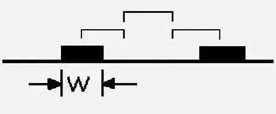
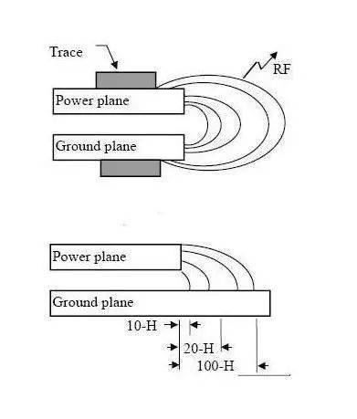

## PCB设计流程

1. 设计原理图
2. 确认原理
3. 检查电器连接是否完全
4. 检查是否封装所有元件，是否尺寸正确
5. 放置元件
6. 检查元件位置是否合理（可打印1：1图比较）
7. 可先布地线和电源线
8. 检查有无飞线（可关掉除飞线层外其他层）
9. 优化布线
10. 再检查布线完整性
11. 比较网络表，查有无遗漏
12. 规则校验，有无不应该的错误标号
13. 文字说明整理
14. 添加制板标志性文字说明
15. 综合性检查

## PCB参数

6mil线宽，8mil线距，12/20mil焊盘

地线、电源线至少10-15mil以上

2A电流：0.5mm过孔

## 多层PCB设计原则

四层板，中间层多用作电源层+地层，注意电源、地平面的安排，电源、地就近打过孔与电源、地平面相连。

1. 引脚之间尽量不要放线，特别是集成电路引脚之间和周围。

2. 3点以上连线，尽量让线顺次通过各点，便于测验，线长尽量短.

3. PCB多层板布线尽量是直线，或45度折线，防止产生电磁辐射。

4. 不同层之间的线尽量不要平行，以免形成实际上的电容。

5. 地线、电源线至少10-15mil以上(对逻辑电路)。

6. 尽量让铺地多义线连在一同，增大接地面积。线与线之间尽量整齐。

7. 注意元件排放均匀，以便安装、插件、焊接操作。文字排放在当前字符层，方位合理，注意朝向，防止被遮挡，便于出产。

8. 元件排放多考虑结构，贴片元件有正负极应在封装和最终标明，防止空间抵触。

9. 现在印制板可作4—5mil的布线，但一般作6mil线宽，8mil线距，12/20mil焊盘。布线应考虑灌入电流等的影响。

10. 功能块元件尽量放在一同，斑马条等LCD附近元件不能太近。

11. 过孔要涂绿油(置为负一倍值)。

12. 电池座下最好不要放置焊盘、过孔等，PAD和VIL尺寸合理。

13. 布线完成后要仔细检查每一个联线(包括NETLABLE)是否真的连接上(可用点亮法)。

14. 振荡电路元件尽量靠近IC，振荡电路尽量远离天线等易受搅扰区。晶振下要放接地焊盘。

15. 多考虑PCB多层板加固、挖空放元件等多种方式，防止辐射源过多。

    

## 3W原则

在PCB设计中为了减少线间串扰，应保证线间距足够大，当线中心间距不少于3倍线宽时，则可保持大部分电场不互相干扰，这就是3W规则。

3W原则是指多个高速信号线长距离走线的时候，其间距应该遵循3W原则，例如时钟线，差分线，视频、音频信号线，复位信号线及其他系统关键电路需要遵循3W原则，而并不是板上所有的布线都要强制符合3W原则。

满足3W原则能使信号间的串扰减少70%，而满足10W则能使信号间的串扰减少近98%。

3W原则虽然易记，但要强调一点，这个原则成立是有先前条件的。从串扰成因的物理意义考量，要有效防止串扰，该间距与叠层高度、导线线宽相关。对于四层板，走线与参考平面高度距离（5~10mils），3W是够了；但两层板，走线与参考层高度距离（45~55mils），3W对高速信号走线可能不够。3W原则一般是在50欧姆特征阻抗传输线条件下成立。

一般在设计过程中因走线过密无法所有的信号线都满足3W的话，我们可以只将敏感信号采用3W处理，比如时钟信号、复位信号。

## 20H原则

是指电源层相对地层内缩20H的距离，当然也是为抑制边缘辐射效应。在板的边缘会向外辐射电磁干扰。将电源层内缩，使得电场只在接地层的范围内传导。有效的提高了EMC。若内缩20H则可以将70%的电场限制在接地边沿内；内缩100H则可以将98%的电场限制在内。

“20H规则”的采用是指要确保电源平面的边缘要比0V平面边缘至少缩入相当于两个平面间层距的20倍。

这个规则经常被要求用来作为降低来自0V/电源平面结构的侧边射击发射技术（抑制边缘辐射效应）。但是，20H规则仅在某些特定的条件下才会提供明显的效果。

这些特定条件包括有：

1、在电源总线中电流波动的上升/下降时间要小于1ns。

2、电源平面要处在PCB的内部层面上，并且与它相邻的上下两个层面都为0V平面。这两个0V平面向外延伸的距离至少要相当于它们各自与电源平面间层距的20倍。

3、在所关心的任何频率上，电源总线结构不会产生谐振。

4、PCB的总导数至少为8层或更多。

## 五五原则

印制板层数选择规则，即时钟频率到5MHz或脉冲上升时间小于5ns，则PCB板须采用多层板，这是一般的规则，有的时候出于成本等因素的考虑，采用双层板结构时，这种情况下，最好将印制板的一面做为一个完整的地平面层。
