## kicad中的层

- Cu：铜层
- Adhesive：粘合层，波峰焊前将SMD元件贴在电路板上的粘合层
- SilkS：丝印层
- Mask：绿油开窗，默认是负片
- Paste：焊膏层
- Courtyard：空间层，表示元件实际占用大小
- Fab：生产层，辅助生产的图示
- Edge.Cuts：边界层

## kicad 输出 gerber 文件 (KiCAD5)

> via: https://support.jlcpcb.com/article/149-how-to-generate-gerber-and-drill-files-in-kicad
>
> kicad6根据这篇：https://support.jlcpcb.com/article/194-how-to-generate-gerber-and-drill-files-in-kicad-6

When you finished your design in KiCad, the last step before sending it off to the fab house is to generate the Gerber and Drill files. PCB fab houses will use these files to make your boards. Basically 3 sets of files need to be generated:

- Gerber files
- Drill files
- Drill map files

The demo project kit-dev-coldfire-xilinx_5213 is used in this article. All the steps are tested in KiCad 5.1.9, there may be some minor differences if you use other KiCad versions.

## Generate Gerbers

| Important | It’s strongly recommended to run DRC check before plotting the Gerbers. |
| --------- | ------------------------------------------------------------ |
|           |                                                              |

Select **File → Plot** from the menu to open the Gerber generation dialog.

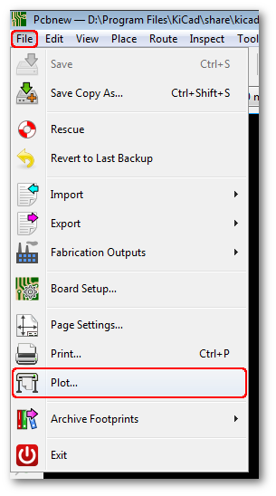

Figure 1. The Plot Menu Item

But to order PCBs from JLCPCB, the default settings **CAN NOT** be used directly, some fine-tunings are needed.

### Select the Target Folder

At the top of the plot window, you can click the browse icon to select/create the target directory or just type the folder name you want. For example, in this tutorial we just type "project-name-gerbers" to replace the default "plots" (use other more meaningful names to replace "project-name"), when KiCad generates Gerbers, the folder will be created automatically.

It’s a good practice to output Gerbers into a separate folder, otherwise, they’ll mess the design files up and you need to pick them out manually.

Figure 2. Select the Target Folder

### Select the Layers

On the left side, you’ll see which layers from our board design we want to turn into Gerber files. The following layers should be all checked.

- F.Cu
- F.Paste
- F.Silks
- F.Mask
- B.Cu
- B.Paste
- B.Silks
- B.Mask
- Edge.Cuts which contains the board outline/cutouts.
- In1.Cu, In2.Cu … are also needed for 4/6 layer designs.

| Note | In KiCad, layers that have a front and back version start with F. (for Front) and B. (for Back), but please note copper layer names can be changed in **File → Board Setup**. The function of each layer can be found in [What is the meaning of the layers in pcb_new and in the footprint editor? (KiCad 5 and earlier)](https://forum.kicad.info/t/what-is-the-meaning-of-the-layers-in-pcb-new-and-in-the-footprint-editor-kicad-5-and-earlier/9688) |
| ---- | ------------------------------------------------------------ |
|      |                                                              |

### General Options and Gerber Options

- Check **Plot footprint references**, otherwise designators will not appear on silkscreen layers.
- Check **Exclude PCB edge layer from other layers**, so the contents on Edge.Cuts won’t appear in other layers.
- Check **Exclude pads from silkscreen**
- Check **Check zone fills before plotting**
- Check **Use Protel filename extensions**, this is recommended as JLCPCB prefers Protel filename extensions.
- Check **Subtract soldermask from silkscreen**, this ensures no silkscreen on pads.
- **Use extended X2 format**, don't care

So, this is the final settings we get:

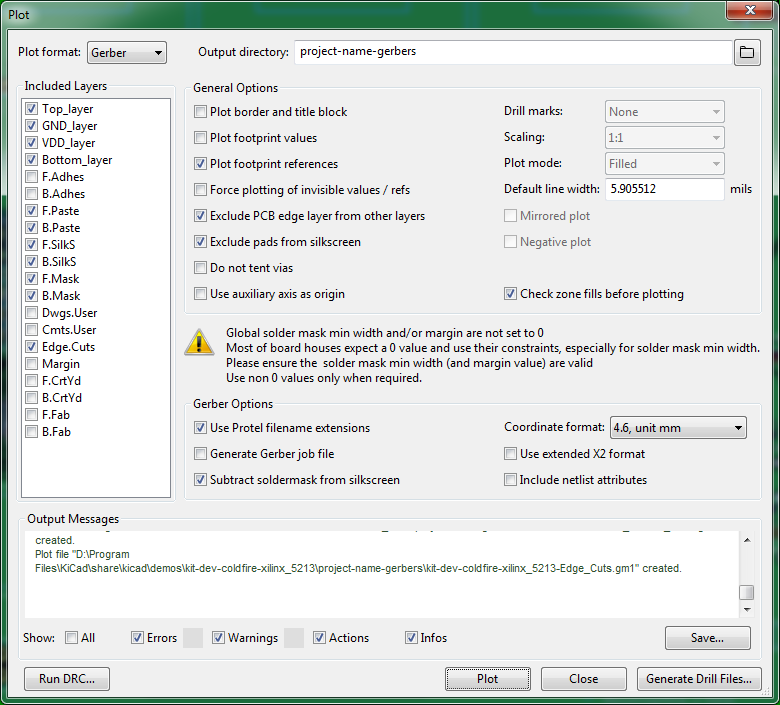

Figure 3. Gerber Options

Now, click the **Plot** button at the bottom of the window. All generated Gerbers will be put in the target folder you specified before.

If the zone fills are out of date and you forgot to refill them, when **Check zone fills before plotting** is ticked, KiCad will ask you to confirm, just click **Refill**, then the file generation will continue.

Figure 4. Refill Zone

To order PCBs, the drill files are also needed.

## Generate Drill Files

In the same dialog for Gerber files, click the **Generate Drill Files** button at bottom right, this will open the dialog for drill files.

You don’t need to change the **Output folder** because KiCad will automatically use the same folder for Gerbers.

Check these options:

- Check **Use alternate drill mode** for "Oval Holes Drill Mode".
- Check **Absolute** for "Drill Origin".
- Check **Millimeters** for "Drill Units".
- Check **Decimal format** for "Zeros Format".

The screenshot below shows the settings:

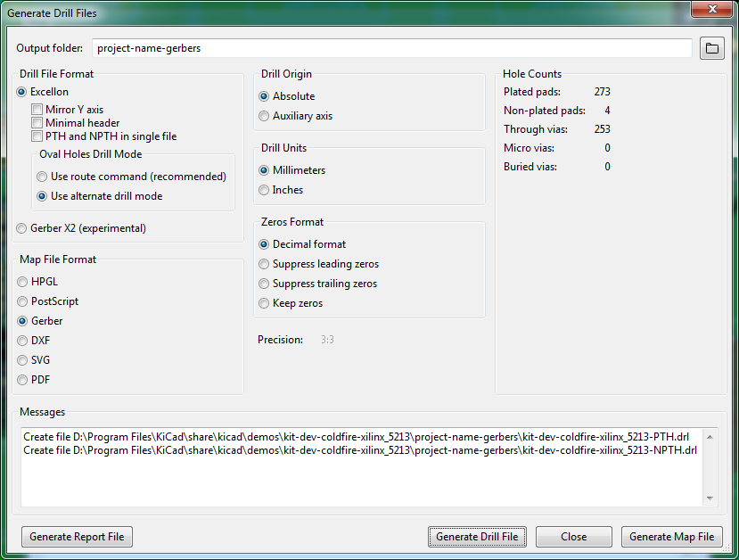

Figure 5. Settings for Drill File

Now, click the **Generate Drill File** button, the drill files will be generated and stored in the output folder.

## Generate Drill Map File

This is optional, but suggested.

This can be done in the same dialog for drill files. Just check **Gerber** for "Map File Format", then click **Generate Map File** button at bottom right of the dialog.

This drill map file provides additional information for drill holes, it is for human reading, it indicates which holes are plated and which are not, it also indicates total slotted holes. More information, less probability of error.

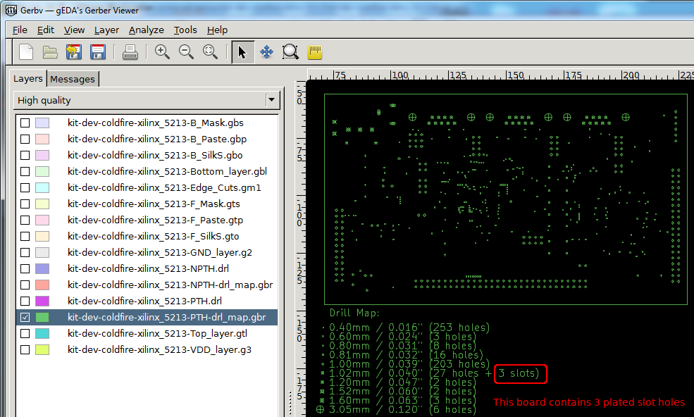

Figure 6. PTH drill map

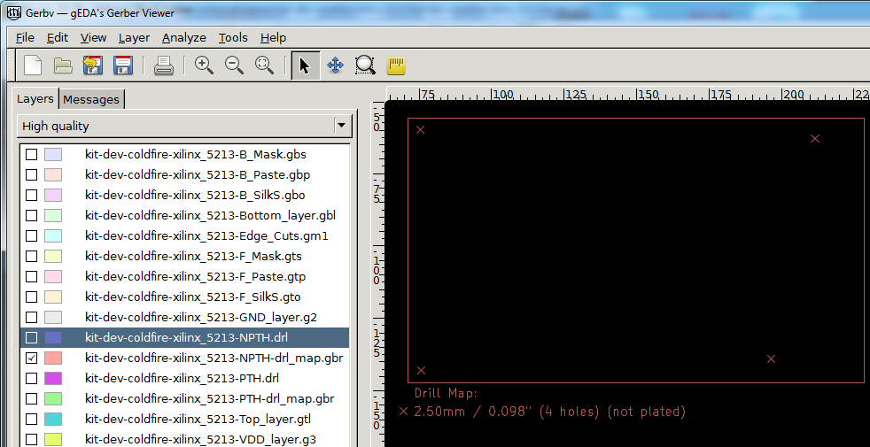

Figure 7. NPTH drill map

## Verify the Files

Before uploading your Gerber files to JLCPCB for production, it’s highly recommended to cross-check the generated files with a 3rd-party Gerber viewer.

When you are checking the file, please pay attention to the following items.

1. Does the board outline exist?
2. Is the board outline watertight(continuous/no gaps)?
3. Do all inner cutouts, unplated slots, V-cut lines show in the GM1 layer correctly?
4. Do all drilling holes shown and are aligned with other layers correctly?
5. Are vias covered or exposed as per your design?
6. And the Silkscreen, do they look good?
7. etc.

If you find any issues, fix them and export the Gerber/Drill files and check them in the Gerber viewer again.

There are some nice Gerber viewers here and there, just use the one you feel handy.

- [Gerbv](http://gerbv.geda-project.org/)
- [tracespace view](https://tracespace.io/view/)
- [Reference gerber viewer](https://gerber.ucamco.com/) from ucamco

If everything is OK, now you can zip the out folder and place the order.

## kicad 输出 SMT 贴片制造文件

> via: https://support.jlcpcb.com/article/84-how-to-generate-the-bom-and-centroid-file-from-kicad

In this tutorial, we will tell you about the steps to generate BOM(Bill of Materials) and CPL(component placement list, as known as a Centroid file/Pick and place file) in KiCAD.

### Generating BOM Files

The BOM or Bill of Materials file tells the manufacturer which components is installed at which position. For example, PCBs have positions like C1,R1,T1 etc. printed on it. But the manufacturer should know what value capacitor or resistor is placed at that location. This information is present in the BOM file and is very important for assembly work. BOM file is a simple text file in comma separated form (csv) but you can also make it in MS Excel or other spreadsheet programs.

As you can see in the above BOM file, we have first column **Comment** where we should describe the parts in as much detail as possible, the most important being the **value of part say 0.1uF** but you should also include tolerance, maximum voltage and other information so that the production staffs can pick the best possible parts for your project. Next column is the **Designator**, that means on which position this part should be placed and soldered. The next one that is the **Footprint** or package is also very important because SMD parts come in various sizes(packages) so the assembly staffs should know which package would fit in your PCB. You should be aware of common SMT sizes like 1206,0805,0603 etc. The last column is **LCSC part number**, now this can really help you speed things up and get accurate results. JLCPCB has a large stock of parts (more than 30,000) and each part has a part number. You can use this part number to accurately identify the part you need. [Simply check if the part you need is in stock at JLCPCBs part library](https://jlcpcb.com/client/index.html#/parts) and add them as LCSC field value to KiCAD

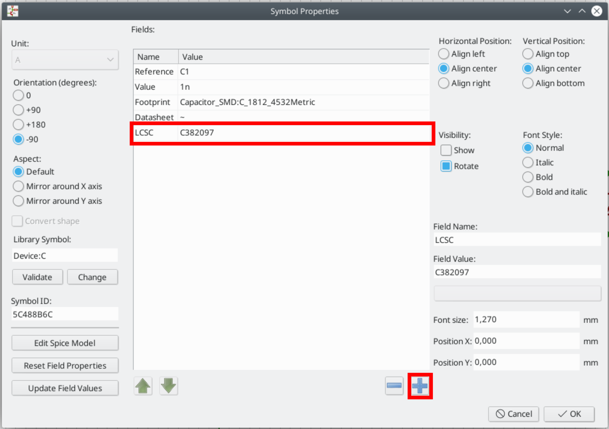

------

To export the BOM from KiCAD you first have to go to [Arturo's BOM export script](https://gist.github.com/arturo182/a8c4a4b96907cfccf616a1edb59d0389), download the Zip and unpack it.

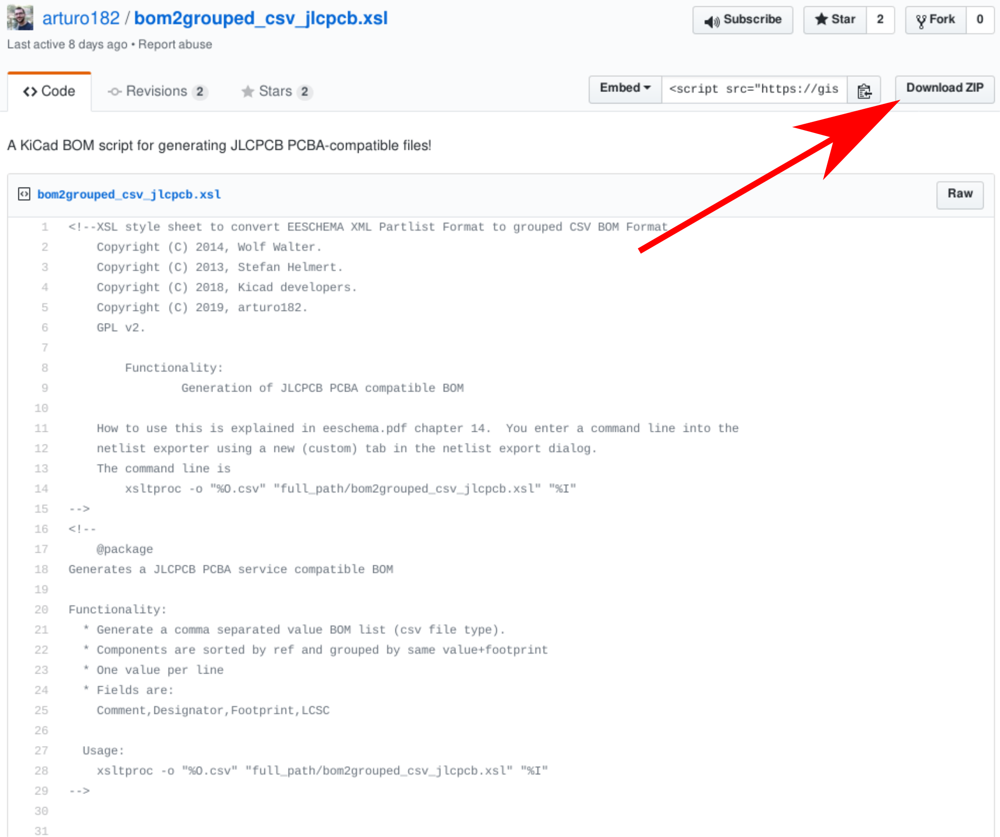

Afterwards you can click on Export BOM and add the bom script to KiCAD (1). Change the command from %O to %O.csv (2) and click on Generate (3). This will generate the BOM needed for assembly.

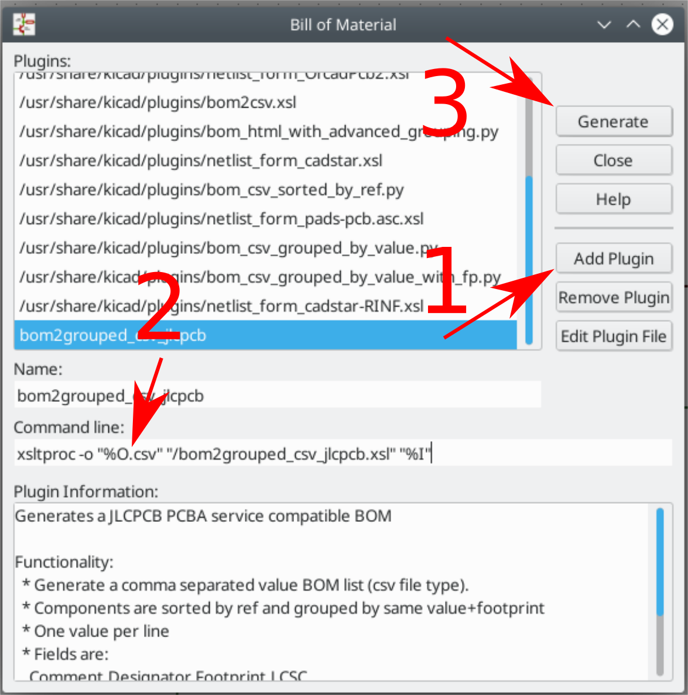

------

### Generating Pick and Place files

The CPL file has to be generated from the PCB editor, click on File -> Fabrication output -> Footprint position (.pos) file and export the file with the following settings.

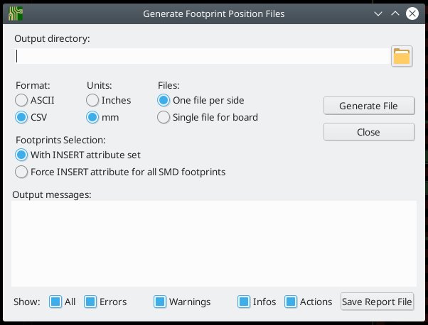

In order to be compliant with JLCSMT you have to edit the CPL/POS file with Excel or libreoffice Calc.

The folling changes are required:

Ref to Designator PosX to Mid X PosY to Mid Y Rot to Rotation Side to Layer

Before, as exported from KiCAD: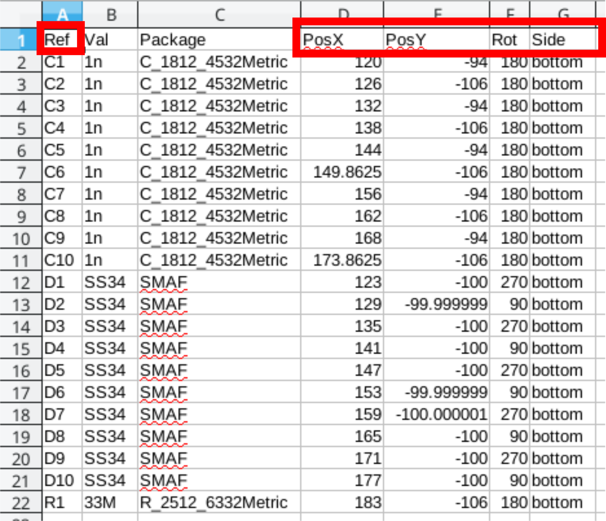After modifying the header: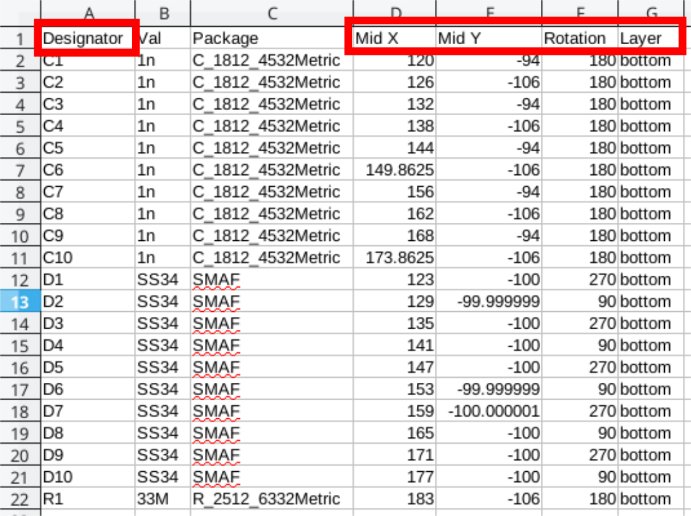

## kicad格式转换

### dxp转kicad

工具：https://github.com/thesourcerer8/altium2kicad

1. 如果原来的文件是ascii格式，先将文件转换成binary格式，立创eda导出的就是这种格式
   - pcbdoc文件，用dxp打开，并重新保存，转成PCB binary格式
   - schdoc文件，用dxp打开，并重新保存，转成SCH binary 5.0格式
2. web工具：http://www2.futureware.at/KiCad/ 转成kicad的pcb
3. 导入符号：将`xxxxx-schdoc-cache.lib`添加到工程的符号库中，打开符号编辑器，将符号复制到自建的库中即可
4. 导入封装：打开转出的pcb，再打开封装编辑器，同工程下复制粘贴，保存封装即可；注意检查焊盘，会缺层！

> 如果原来的文件就是AD创建的PCB binary格式，直接导入可能出问题，可以先导入立创eda再导出dxp，再走上面的流程

## kicad中布定长的线、差分线

定长的线：布线-调整单轨布线长度（绕蛇形线功能），选择线，右键菜单中”长度优化设置”设置目标长度

差分线：

- 网络名以`_N/_P`或者`+/-`，布线-差分对交互布线
- 调整长度：布线-调整差分布线偏移，默认偏移是0也就是等长

