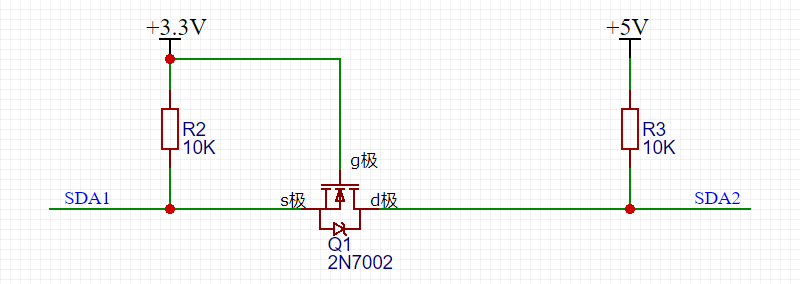
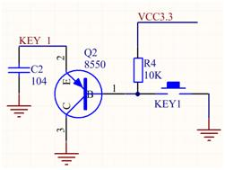

## MOS电平转换电路

> via: https://www.eet-china.com/mp/a41803.html

分四种情况：

1. 当SDA1输出高电平时：MOS管Q1的Vgs = 0，MOS管关闭，SDA2被电阻R3上拉到5V。
2. 当SDA1输出低电平时：MOS管Q1的Vgs = 3.3V，大于导通电压，MOS管导通，SDA2通过MOS管被拉到低电平。
3. 当SDA2输出高电平时：MOS管Q1的Vgs不变，MOS维持关闭状态，SDA1被电阻R2上拉到3.3V。
4. 当SDA2输出低电平时：MOS管不导通，但是它有体二极管！MOS管里的体二极管把SDA1拉低到低电平，此时Vgs约等于3.3V，MOS管导通，进一步拉低了SDA1的电压。

## 工业按键电路

- 三极管，使IO口和按键隔离
- 电容消除抖动

