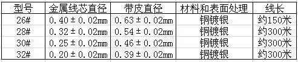
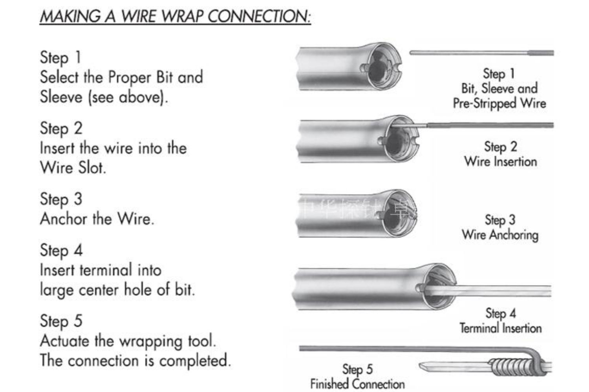
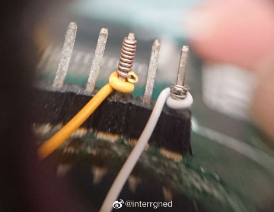

## wire wrap 绕线工艺

(图via [interrgned)](https://weibo.com/interrgned)

接线时代的工艺, 现在电子上已经很少用了

>  via: wiki <https://en.wikipedia.org/wiki/Wire_wrap>

绕线结构可以生产比印刷电路更可靠的组件：由于基板上的振动或物理应力，连接不易发生故障，并且缺少焊料可防止焊接故障，例如腐蚀，焊锡过热或过冷。

绕线结构在电路板制造中于1960年左右开始流行，现在使用量急剧下降。表面贴装技术使该技术的使用效率低于前几十年。无焊料面包板和专业制造的PCB的成本降低几乎消除了这项技术。

## wire wrap 绕线工艺 工具和方法

**工具**

* OK牌 手动绕线笔
* OK线 维修飞线 焊接线 航空线

**OK线的规格**

#30似乎tb上卖得最多，#28粗一点对于DIY会更好用一些（但似乎会贵一点）。

**绕线笔使用方法**

根据@interrgned的建议，完成绕线之后，再手动绕上一圈半的绝缘皮，会更牢固耐用：

