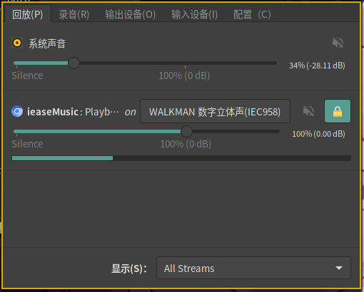

---


### ibus配置

配置文件在`~/.config/ibus`

.xprofile：

```
export GTK_IM_MODULE=ibus
export XMODIFIERS=@im=ibus
export QT_IM_MODULE=ibus
ibus-daemon -d -x
```

默认输入法为第一个，顺序在dconf中配置：`desktop/ibus/general/engines-order`。

### 安装字体


```
mkdir /usr/share/fonts/<font_name>
cd /usr/share/fonts/<font_name>
mkfontscale
mkfontdir
fc-cache -fv
```


## 中文字体

文泉驿字体wqy-microhei wqy-zenhei

思源字体adobe-source：思源宋体source-han-serif；思源黑体source-han-sans


## 中文等宽字体

MSharp DG Console Blod 11号


## 设置记录

分辨率1080p，cinnamon环境

非等宽：文泉驿微米黑Regular 10号

等宽：MSharp DG Console Blod 11号

## JRE程序改善字体

https://stackoverflow.com/questions/17510099/ugly-fonts-in-java-applications-on-ubuntu

```
# Install both infinality and fontfix'ed JDK.
sudo add-apt-repository ppa:no1wantdthisname/ppa
sudo add-apt-repository ppa:no1wantdthisname/openjdk-fontfix
sudo apt-get update
sudo apt-get install fontconfig-infinality openjdk-7-jdk
# Apply a font style that looks good.
sudo /etc/fonts/infinality/infctl.sh setstyle linux
# And reboot the system.
sudo reboot
```

## gnome下字体改善
安装gnome-tweak


## fontconfig-infinality

> todo: 


## linux和windows的系统时间同步

Windows把RTC时间当作本地时间，而Linux/Unix/Mac把RTC时间当作 UTC，所以Windows和其他系统共存时会出问题。在Linux中迁就一下Windoze还是比较方便的：

```
# timedatectl set-local-rtc 1
```


## Linux桌面 自动执行

refer: https://wiki.archlinux.org/index.php/Autostarting

开机/关机时->systemd

用户登入/登出时->`systemd/User`

设备插入/拔出时->`udev`

定时执行（循环地）->`systemd/Timers` or `Cron`

定时执行（定时执行一次）->`systemd/Timers` or `at`

文件系统事件->`inotify-tools`、`incron`、`fswatch`

shell登入->`/etc/profile`、shell程序的用户配置如`.bashrc`

Xorg启动时->`.xinitrc`（执行xinit时）、`.xprofile`（使用display manager时）

桌面环境启动时->桌面环境会实现[XDG规范](https://specifications.freedesktop.org/autostart-spec/autostart-spec-latest.html)的`$HOME/.config/autostart`目录，例如坚果云的`nutstore-daemon.desktop`：

```
[Desktop Entry]
Encoding=UTF-8
Type=Application
Terminal=false
Icon=nutstore-small
Exec=sh -c "(sleep 30 && nohup /opt/nutstore/bin/nutstore-pydaemon.py >/dev/null 2>&1) &"
Name=Nutstore
Name[zh_CN]=坚果云
Comment=AutoStart Nutstore
Comment[zh_CN]=自动启动坚果云
```

窗口管理器（window manager）启动时->如i3wm的`$HOME/.config/i3/config`。

## 声音

控制系统音量的命令，可以自己绑定按键：

```
减音量：
amixer -D pulse sset Master 3%- unmute
增音量：
amixer -D pulse sset Master 3%+ unmute
静音：
amixer -D pulse sset Master toggle
```

混音控制台软件推荐使用`pavucontrol`：



也许还需要一个音量Icon方便呼出这个混音控制台，`volumeicon`包，在`.xprofile`里添加`nohup volumeicon &`，修改配置`$HOME/.config/volumeicon/volumeicon`：

```
[Alsa]
card=default

[Notification]
show_notification=true
notification_type=0

[StatusIcon]
stepsize=5
onclick=pavucontrol
theme=Default
use_panel_specific_icons=false
lmb_slider=true
mmb_mute=false
use_horizontal_slider=false
show_sound_level=true
use_transparent_background=false

[Hotkeys]
up_enabled=true
down_enabled=true
mute_enabled=true
up=XF86AudioRaiseVolume
down=XF86AudioLowerVolume
mute=XF86AudioMute
```

## nvidia闭源显卡驱动配置

Arch系下，配置程序在`nvidia-utils`包中，使用`nvidia-settings`GUI程序进行配置。

### nvidia 闭源显卡驱动 撕裂问题

在`nvida-settings`程序中配置Nvidia X server setting中启用force full composition pipeline


## Linux打印机服务

CUPS=公共UNIX打印系统（Comon UNIX Printing System）

```
$ sudo pacman -S cups
$ sudo systemctl enable cups
$ sudo systemctl start cups
```

确认是否成功配置：http://localhost:631
