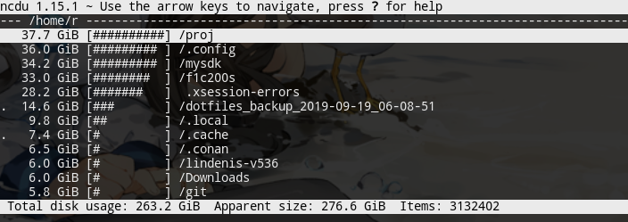

---

## minicom

minicom linux下好用的串口通讯工具:

```
$ minicom -D /dev/ttyUSB0
```

## tree 

打印树型目录结构，可指定层数。

```
$ tree -L 3
```

## locate

 利用文件索引缓存快速全盘查找文件

## progress（cv）

<https://github.com/Xfennec/progress>

 coreutils viewer，显示coreutils 中的基本命令的进度，比如 cp、mv、rm、dd、tar，基本用法`progress -wm`

安装：

```bash
$ yay -S progress-git
```

别名`cv`放~/.bashrc里：
```
#progress
alias cv="progress -w"
```

## sysstat查看资源情况


- cifsiostat: CIFS使用情况（CIFS共享协议）
- mpstat: 处理器使用情况
- iostat: 查看IO使用情况，输出例：
  ```
  ~ ᐅ iostat
  Linux 5.4.116-1-MANJARO (r-lh) 	2021年05月14日 	_x86_64_	
  
  avg-cpu:  %user   %nice %system %iowait  %steal   %idle
            19.69    0.00    1.83    0.70    0.00   77.78
  
  Device             tps    kB_read/s    kB_wrtn/s    kB_dscd/s    kB_read    kB_wrtn    kB_dscd
  md127           212.60     23405.41     67813.10         0.00  594233841 1721689240          0
  nvme0n1          86.08     11575.78     24663.27         0.00  293894451  626169368          0
  nvme1n1          84.12     11569.55     24645.65         0.00  293736400  625721876          0
  sda              56.94        98.01       504.19         0.29    2488333   12800713       7360
  sdb               0.11        10.14         0.00         0.00     257502         32          0
  ```
- pidstat: 查看进程资源使用情况

  ```
  ~ ᐅ pidstat -G code
  Linux 5.4.116-1-MANJARO (r-lc) 	2021年05月14日 	_x86_64_	
  
  16时20分19秒   UID       PID    %usr %system  %guest   %wait    %CPU   CPU  Command
  16时20分19秒  1000     19902    0.02    0.01    0.00    0.00    0.04     4  code
  16时20分19秒  1000     19923    0.00    0.00    0.00    0.00    0.00     2  code
  16时20分19秒  1000     19924    0.00    0.00    0.00    0.00    0.00     0  code
  16时20分19秒  1000     19954    0.02    0.01    0.00    0.00    0.03     2  code
  16时20分19秒  1000     19973    0.01    0.01    0.00    0.00    0.01     4  code
  16时20分19秒  1000     20013    0.87    0.23    0.00    0.00    1.10     6  code
  16时20分19秒  1000     20097    0.64    0.41    0.00    0.00    1.05     2  code
  16时20分19秒  1000     20171    0.05    0.01    0.00    0.00    0.06     1  code
  16时20分19秒  1000     20185    0.00    0.00    0.00    0.00    0.00     0  code
  16时20分19秒  1000     20202    0.00    0.00    0.00    0.00    0.00     2  code
  16时20分19秒  1000     20278    0.00    0.00    0.00    0.00    0.00     2  code
  ```

  

## lm_sensors

查看传感器温度，cpu、主板、显卡温度等。

```
[r@r-pc test-activity]$ sensors 
k10temp-pci-00c3
Adapter: PCI adapter
Tdie:         +43.2°C  (high = +70.0°C)
Tctl:         +43.2°C  

amdgpu-pci-3800
Adapter: PCI adapter
vddgfx:           N/A  
vddnb:            N/A  
fan1:             N/A
temp1:        +43.0°C  (crit = +80.0°C, hyst =  +0.0°C)


```


## Time Cat （tcat）

https://github.com/marcomorain/tcat

给每一行文本打上时间戳


## Pacapt

安装方法：https://github.com/icy/pacapt#installation

包管理器的命令行包装，用于把大多数包管理器的命令转成arch系的pacman式命令，用法：

```
$ pacapt -Ss somepackage
```


## mplayer

在framebuffer全屏循环播放视频：

```
$ mplayer -fs -loop 0 -vo fbdev xxx.mp4
```


## homebrew

macos自带的包管理器，其实Linux和windows的WSL也能用。

可以在home目录下安装软件，不需要root权限。

## screenfetch Linux系统摘要打印

一键打印当前linux的信息摘要

## ncdu unix命令行下磁盘空间占用统计

`Disk usage analyzer with an ncurses interface`



## X11下复制文本到粘贴板

Linux桌面，常需要手动复制命令行下当前路径

1. 实际复制的操作可以用命令完成，需要安装`xsel`和`xclip`工具：

```
$ echo barhaha123 | xclip -selection c
```

2. 简化操作

```
$ alias xclip='xclip -selection c'
$ pwd |xcilp
```

