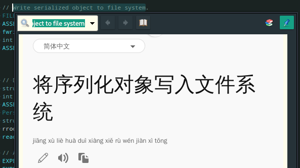

---

深度截图
https://www.deepin.org/en/original/deepin-screenshot/

https://www.freedesktop.org/wiki/Software/

terminator终端图形化分栏
https://gnometerminator.blogspot.com/

图形化文件管理器（可sftp）
https://krusader.org/

对比工具kdiff3

视力保护redshift

番茄钟gnome-shell-pomodoro   https://gnomepomodoro.org/

gparted 图形化的分区管理工具，易用。

barrier   一个从“Synergy” fork出来的通过网络连接共享鼠标键盘的工具，客户端可以用服务器的鼠标、键盘资源，分享剪切板

## nemo

cinnamon默认的文件管理器，简单好用。


连接网络目标、外部设备很方便。

“空格键”可以预览文件内容，难得的是还带高亮。

> P.S 然而挂掉的几率似乎有点高

## linux下用罗技m570轨迹球鼠标上的的按钮

https://lovingboth.com/logitech-m570-trackball-buttons-in-linux/

```
cd ~
sudo apt-get install xbindkeys xautomation

Create a file ~/.xbindkeysrc and put

"xte 'key Page_Up'"
b:9

"xte 'key Page_Down'"
b:8

(when 'button 9' is pressed, run the xte program to emulate a 'PgUp' keystroke, and similarly when 'button 8' is pressed, emulate a 'PgDn' keystroke) in it with your favourite text editor. Run

xbindkeys
```

## GoldenDict 词典

windows build:

https://github.com/goldendict/goldendict/wiki/Early-Access-Builds-for-Windows

兼容EPWING字典格式, 还可以很方便的查wiki.

> Babylon dictionaries (.BGL), complete with images and resources
> StarDict dictionaries (.ifo/.dict./.idx/.syn)
> DictD dictionaries (.index/.dict(.dz))
> ABBYY Lingvo source files (.dsl(.dz)), together with abbreviations.
> Xdxf dictionaries (.xdxf(.dz))
> AardDictionary dictionaries (.aar)
> SDictionary dictionaries (.dct)
> Zim dictionaries (.zim)
> MDict dictionaries (.mdx/.mdd)
> Epwing dictionaries
> Slob dictionaries (.slob)
> ABBYY Lingvo sound archives (.lsa/.dat)
> Sound files in separate folders
> Zips sound packs (.zips) 


### 在GoldenDict里整句翻译

添加词典-网站，这里用的必应：

```
https://cn.bing.com/translator/?ref=TThis&text=%GDWORD%&from=&to=zh-Hans
```



### GoldenDict 在 Linux 下无法播放语音的解决方法

修改设置项“播放”为“使用外部程序播放”：

```
cvlc  --play-and-exit -Vdummy
```


##  FreeRDP远程桌面

windows的3389远程桌面使用的是RDP协议

linux下实现的服务端和客户端, 是FreeRDP: <https://github.com/FreeRDP/FreeRDP>

使用例：

```
$ xfreerdp /u:username /p:xxxxxx /w:1900 /h:1040 /v:computer.local
```

技巧：

1. 右 Ctrl 键可以释放键盘的捕获

## yakuake

下拉式的终端界面，配合着固定式的使用很方便。


## gedit

gnome的默认编辑器，界面美观操作友好。

在i3wm下工作良好，同一工作区打开的文件会合并到同一窗口.

* Notepadpp，i3wm下对工作区支持不好，无法在不同工作区打开不同实例；有换行bug，有些时候按下箭头按键无法下翻

* xed太过简单

功能得靠插件：

列编辑(中文支持不好。。) https://github.com/code-tree/imitation/

插件集1: gedit-plugins

插件集2: https://github.com/gmate/gmate

## feh

一个命令行图像查看器，可以用来设置桌面背景，例如定期随机设置背景，`random-bg-picture.sh`：

```
#!/bin/bash

while :
do
	feh --randomize --bg-fill ~/Pictures/BG
	sleep 900
done
```

不清楚为什么watch命令置后台后后不起作用，用这个脚本里跑sleep就正常。

## gpick

取色工具，能取到屏幕上的颜色，并方便地显示、转换成其他颜色格式。
按空格保存颜色。

## LinSSID 无线网络信号扫描工具


```
$ sudo pacman -S linssid
```

## peek

屏幕录制工具，很精简实用


## USBView

Windows上有USBTreeViewer，Linux的lsusb不太直观，USBView就可以派上用场：

