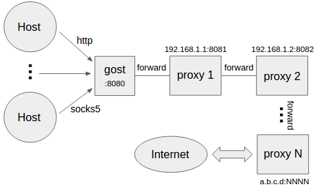

## gost 文档摘

https://github.com/ginuerzh/gost

### 设置转发代理

[](https://camo.githubusercontent.com/3d3ffc569b6d352522f517876bd8441b2ba98b499058bd2d5344fb0bb242b0e6/68747470733a2f2f67696e7565727a682e6769746875622e696f2f696d616765732f676f73745f30322e706e67)

```
gost -L=:8080 -F=192.168.1.1:8081
```


### 设置多级转发代理(代理链)

[](https://camo.githubusercontent.com/5c6e7c9762de489f62a5d4c68a1710d705db8a23b4a3c0e5c686811132e9be59/68747470733a2f2f67696e7565727a682e6769746875622e696f2f696d616765732f676f73745f30332e706e67)

```
gost -L=:8080 -F=quic://192.168.1.1:6121 -F=socks5+wss://192.168.1.2:1080 -F=http2://192.168.1.3:443 ... -F=a.b.c.d:NNNN
```

gost按照-F设置的顺序通过代理链将请求最终转发给a.b.c.d:NNNN处理，每一个转发代理可以是任意HTTP/HTTPS/HTTP2/SOCKS4/SOCKS5/Shadowsocks类型代理。