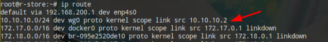

## WireGuard

因为家庭宽带没有IPv4，NAS在外无法方案，所以买了个VPS做流量转发，又因为VPS只有IPv4网络，所以先组VPN与NAS网络互通。

WireGuard和OpenVPN、Zerotier之类功能类似，就是虚拟局域网，相较竞品的特点就是极简，使用简单、功能简单。


WireGuard以下简称wg。


### wg的配置涉及到的概念

截一段manual中的配置例：

```
[Interface]
PrivateKey = yAnz5TF+lXXJte14tji3zlMNq+hd2rYUIgJBgB3fBmk=
ListenPort = 51820

[Peer]
PublicKey = xTIBA5rboUvnH4htodjb6e697QjLERt1NAB4mZqp8Dg=
Endpoint = 192.95.5.67:1234
AllowedIPs = 10.192.122.3/32, 10.192.124.1/24

[Peer]
PublicKey = TrMvSoP4jYQlY6RIzBgbssQqY3vxI2Pi+y71lOWWXX0=
Endpoint = [2607:5300:60:6b0::c05f:543]:2468
AllowedIPs = 10.192.122.4/32, 192.168.0.0/16

[Peer]
PublicKey = gN65BkIKy1eCE9pP1wdc8ROUtkHLF2PfAqYdyYBz6EA=
Endpoint = test.wireguard.com:18981
AllowedIPs = 10.10.10.230/32
```

Interface，本机接口：

- PrivateKey，本机的私钥
- ListenPort：监听的端口，不指定就随机（希望其他人连接这台机器就指定清楚，让其他peer指定Endpoint时带上这个端口）
- Address：本机在wg网络中的地址


Peer，wg不分服务端、客户端，Peer就是对等的节点：

- PublicKey，节点的公钥，也就是允许持有对应私钥的Peer接入网络
- Endpoint，peer对应的主机，可以写作`39.156.66.10:5432`
- AllowedIPs，允许该 Peer 在隧道中使用的 IP段，通常是该 Peer 的隧道 IP 地址和通过隧道的路由网络，工具可能会根据这个选项自动设置路由表


### 安装、配置、基本使用

wg需要用到内核特性，Linux 5.6以后自带，而这之前需要安装内核模块，比如在ubuntu上是`wireguard-dkms`这个包，以及工具`wireguard-tools`

```
看当前状态：
wg

wg-quick工具帮助从`/etc/wireguard/<INTERFACE>.conf`配置文件，快速配置接口，如：
wg-quick up wg0
wg-quick down wg0
```


### VPS上配置

生成公私钥：

```
wg genkey | tee wg0-prikey | wg pubkey > wg0-pubkey
```

配置`/etc/wireguard/wg0.conf`

```
[Interface]
Address = 10.10.10.1/24
ListenPort = 5432（因为本机有IPv4公网地址，所以需要暴露明确的端口）
PrivateKey = (VPS的私钥)

[Peer]
PublicKey = （写NAS的公钥）
AllowedIPs = 10.10.10.2/32（这里就一台机器，直接写死NAS地址）
PersistentKeepalive = 25
```

开启：

```
$ wg-quick up wg0
```


### NAS上配置

一样要先生成公私钥，然后配置`/etc/wireguard/wg0.conf`

```
[Interface]
Address = 10.10.10.2/24
PrivateKey = (NAS的私钥)

[Peer]
Endpoint = （VPS的IP）:5432
AllowedIPs = 10.10.10.1/32（直接写死VPS的IP地址）
PublicKey = （写VPS的公钥）
PersistentKeepalive = 25
```

用wg-quick开启接口即可


### 调试

这时应该就可以相互ping通了，如果不通，建议按以下顺序调试：

1. 各peer分别用`wg`命令看当前状态，如：

```
interface: wg0
  public key: 5MQ48dLW/ngQCd7WcHYGzDCt5G6UbDwnpFyWY0He/Dg=
  private key: (hidden)
  listening port: 42791

peer: hJkRu0eHnzstHTpuACPTDQ83S6QuZ/vU9rMLE5IVkUw=
  endpoint: (..VPS的IP..):5432
  allowed ips: 10.10.10.1/32
  latest handshake: 46 seconds ago
  transfer: 2.86 MiB received, 145.47 MiB sent
  persistent keepalive: every 25 seconds
```

要是latest handshake在很久之前，或者根本没这条信息，很可能到endpoint的udp根本不通。

2. 如果wg状态正常，优先检查路由配置，应该能看到peer的AllowedIPs配置了对应的路由条目：



