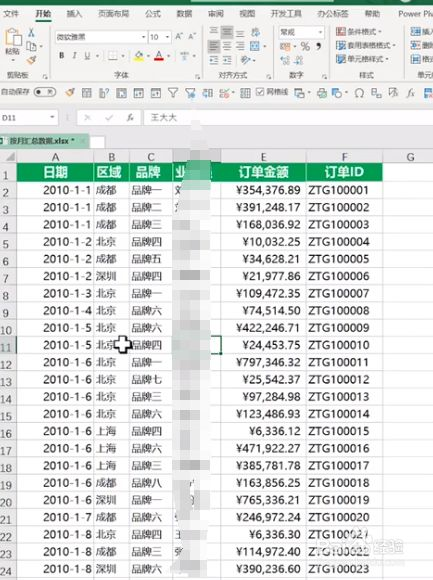
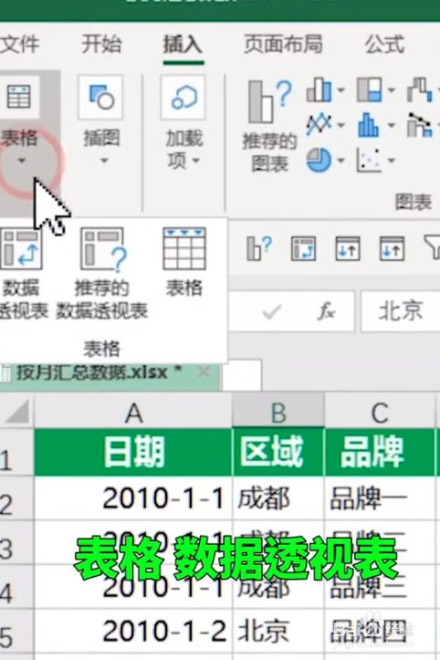
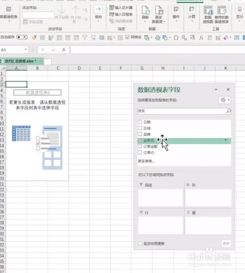
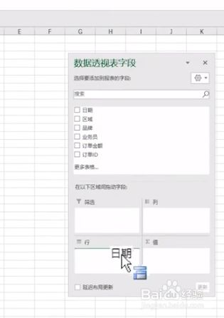
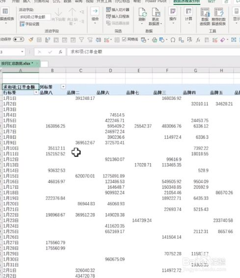
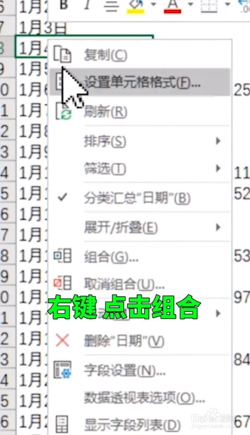
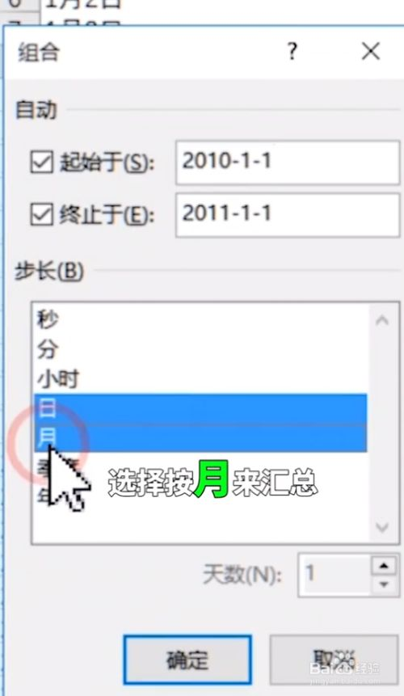
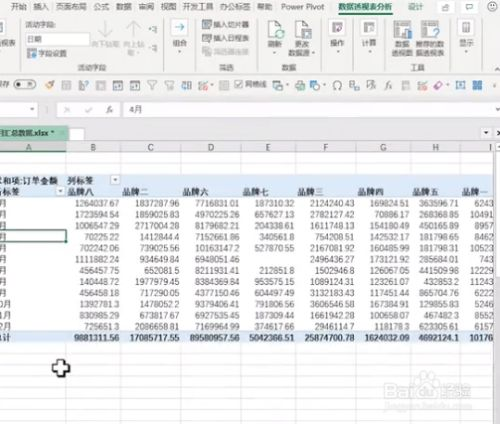

## 数据透视表

统计时很好用

> via: https://jingyan.baidu.com/article/0aa22375f35966c8cd0d6460.html

1. 打开一张营销数据的案例excel表。

   

   我们点击插入表格，选择数据透视表，点击确定。

   

   我们将日期，品牌，订单金额分别拖入行区域，列区域和值区域。

   

   

   此时我们可以看到生成的报表还是按日统计的。

   

   点击一个日期 ，按右键选择组合。

   

   在里面选择按月汇总，点确定。

   

   这样一张表就按月汇总，同理可以按年汇总。

   