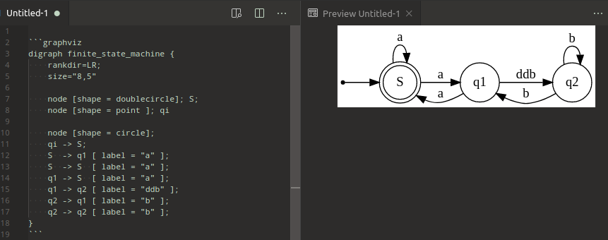

# graphviz - 图形绘制工具包

官方自述的翻译：

> Graphviz是开源的图形可视化软件。图形可视化是一种将结构信息表示为抽象图形和网络图的方式。它在网络，生物信息学，软件工程，数据库和网页设计，机器学习以及其他技术领域的可视界面中具有重要的应用。
>
> Graphviz布局程序以简单的文本语言获取图形描述，并以有用的格式制作图表，例如用于网页的图像和SVG； PDF或Postscript包含在其他文档中；或在交互式图形浏览器中显示。 Graphviz具有用于具体图表的许多有用功能，例如颜色，字体，表格节点布局，线型，超链接和自定义形状的选项。

graphviz允许用户使用标记语言描述图表，渲染成各种格式。

## graphviz在markdown中的使用

测试一下渲染器里带graphviz支持了没：

vscode中使用`Graphviz Markdown`插件:

